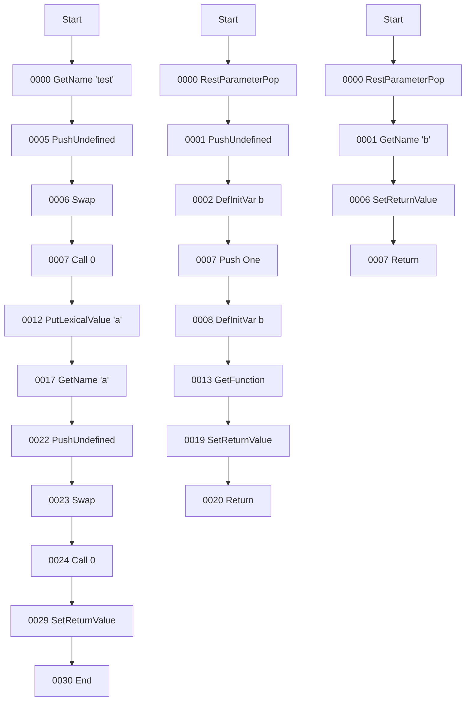
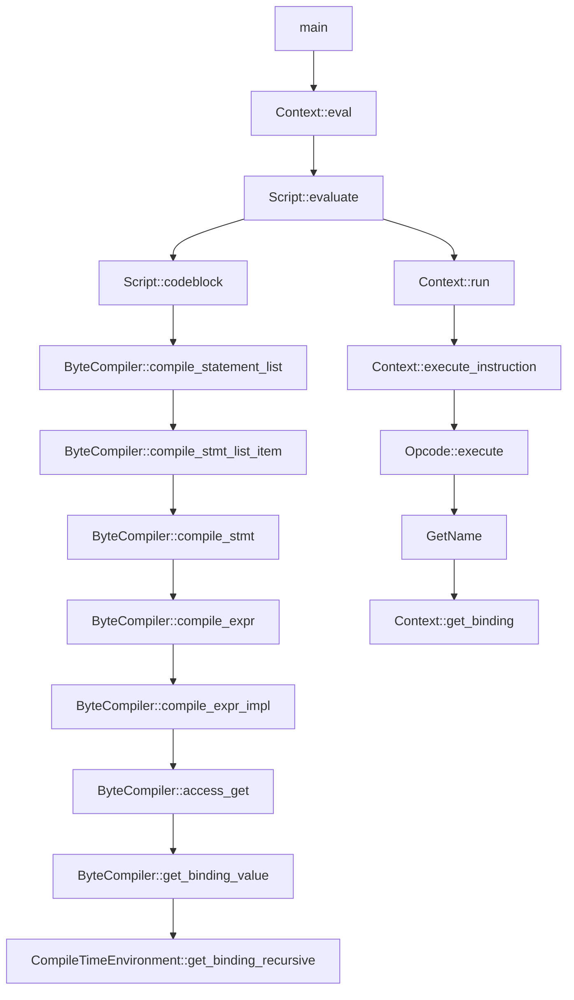

# 从JS引擎源码分析作用域

首先看下MDN中对于作用域的解释[Scope](https://developer.mozilla.org/zh-CN/docs/Glossary/Scope)

我的理解就是作用域代表了执行到某个代码段，代码段中可以访问哪些变量或方法。

概念还是比较模糊的，希望通过读取一个JS引擎的源码彻底弄懂

[引擎源码boa](https://github.com/boa-dev/boa/tree/06bb71aa50e7163f6b38767190ba30177086685f)


## 首先是一段JS代码

```javascript
function test() {
    var b = 1;
    return function() {
        return b
    }
}

const a = test()
a()

```

## 编译后的字节码

这段代码编译的字节码



## 这是执行的掉用堆栈




## 源码分析

### main

这边main函数读取输入，掉用`context.eval`

``` rust
// boa/boa_cli/src/main.rs:448
fn main() -> Result<(), io::Error> {
    ...
    match context.eval(Source::from_bytes(line.trim_end())) {
        Ok(v) => {
            println!("{}", v.display());
        }
        Err(v) => {
            eprintln!("{}: {}", "Uncaught".red(), v.to_string().red());
        }
    }
    ...
}
```

### Context::eval

`eval`先执行`parse`将源代码解析成`AST`，然后执行`evaluate`执行脚本

```rust
// boa/boa_engine/src/context/mod.rs:175
#[allow(clippy::unit_arg, dropping_copy_types)]
pub fn eval<R: Read>(&mut self, src: Source<'_, R>) -> JsResult<JsValue> {
    let main_timer = Profiler::global().start_event("Script evaluation", "Main");

    let result = Script::parse(src, None, self)?.evaluate(self);

    drop(main_timer);
    Profiler::global().drop();

    result
}
```

### Script::evaluate

`evaluate`先执行`codeblock`进行字节码编译，然后执行`context.run`

``` rust
// boa/boa_engine/src/script.rs:138
pub fn evaluate(&self, context: &mut Context<'_>) -> JsResult<JsValue> {
    let _timer = Profiler::global().start_event("Execution", "Main");
    let codeblock = self.codeblock(context)?;

    let old_realm = context.enter_realm(self.inner.realm.clone());
    let active_function = context.vm.active_function.take();
    let old_active = context
        .vm
        .active_runnable
        .replace(ActiveRunnable::Script(self.clone()));
    let env_fp = context.vm.environments.len() as u32;
    context
        .vm
        .push_frame(CallFrame::new(codeblock).with_env_fp(env_fp));

    self.realm().resize_global_env();
    let record = context.run();
    context.vm.pop_frame();

    context.vm.active_function = active_function;
    context.vm.active_runnable = old_active;
    context.enter_realm(old_realm);
    context.clear_kept_objects();
    record.consume()
}
```

### Script::codeblock

这边先掉用`global_declaration_instantiation`初始化全局声明，再通过`compile_statement_list`编译所有代码

``` rust
// boa/boa_engine/src/script.rs:120
pub fn codeblock(&self, context: &mut Context<'_>) -> JsResult<Gc<CodeBlock>> {
    let mut codeblock = self.inner.codeblock.borrow_mut();

    if let Some(codeblock) = &*codeblock {
        return Ok(codeblock.clone());
    };

    let _timer = Profiler::global().start_event("Script compilation", "Main");

    let mut compiler = ByteCompiler::new(
        Sym::MAIN,
        self.inner.source.strict(),
        false,
        self.inner.realm.environment().compile_env(),
        context,
    );
    compiler.global_declaration_instantiation(&self.inner.source)?;
    compiler.compile_statement_list(self.inner.source.statements(), true, false);

    let cb = Gc::new(compiler.finish());

    *codeblock = Some(cb.clone());

    Ok(cb)
}
```

### ByteCompiler::compile_statement_list

这边循环编译每个`item`

``` rust
// boa/boa_engine/src/bytecompiler/mod.rs:874
pub fn compile_statement_list(&mut self, list: &StatementList, use_expr: bool, block: bool) {
    if use_expr || self.jump_control_info_has_use_expr() {
        ...
        for (i, item) in list.statements().iter().enumerate() {
            self.compile_stmt_list_item(item, i == use_expr_index, block);
        }
    } else {
        ...
    }
}
```

### ByteCompiler::compile_stmt_list_item

根据`statement`还是`declaration`进行不同的编译，这边掉用了`compile_stmt`

``` rust
// boa/boa_engine/src/bytecompiler/mod.rs:1143
fn compile_stmt_list_item(&mut self, item: &StatementListItem, use_expr: bool, block: bool) {
    match item {
        StatementListItem::Statement(stmt) => {
            self.compile_stmt(stmt, use_expr, false);
        }
        StatementListItem::Declaration(decl) => self.compile_decl(decl, block),
    }
}
```

### ByteCompiler::compile_stmt

根据不同的`statement`类型进行编译，这边如果是表达式就掉用`compile_expr`

``` rust
// boa/boa_engine/src/bytecompiler/statement/mod.rs:81
pub fn compile_stmt(&mut self, node: &Statement, use_expr: bool, root_statement: bool) {
    match node {
       ...
        Statement::Expression(expr) => {
            self.compile_expr(expr, use_expr);
            if use_expr {
                self.emit_opcode(Opcode::SetReturnValue);
            }
        }
        ...
    }
}
```

### ByteCompiler::compile_expr

直接调用`compile_expr_impl`

``` rust
// boa/boa_engine/src/bytecompiler/mod.rs:886
    #[inline]
    pub fn compile_expr(&mut self, expr: &Expression, use_expr: bool) {
        self.compile_expr_impl(expr, use_expr);
    }
```

### ByteCompiler::compile_expr_impl
根据不同的`expr`调用不同的编译函数,这边是展示了`Expression::Identifier`，它内部掉用`access_get`,如果是函数`Expression::Function`，则掉用`function_with_binding`

``` rust
// boa/boa_engine/src/bytecompiler/expression/mod.rs:93
pub(crate) fn compile_expr_impl(&mut self, expr: &Expression, use_expr: bool) {
        match expr {
            ...
            Expression::Identifier(name) => {
                self.access_get(Access::Variable { name: *name }, use_expr);
            },
            ...
            Expression::Function(function) => {
                self.function_with_binding(function.into(), NodeKind::Expression, use_expr);
            }
            ...
        }
}
```

### ByteCompiler::access_get

此处匹配`Access::Variable`执行`get_binding_value`

``` rust
    // boa/boa_engine/src/bytecompiler/mod.rs:655
    fn access_get(&mut self, access: Access<'_>, use_expr: bool) {
        match access {
            Access::Variable { name } => {
                let binding = self.get_binding_value(name);
                let index = self.get_or_insert_binding(binding);
                self.emit(Opcode::GetName, &[Operand::U32(index)]);
            }
           ...
        }

        if !use_expr {
            self.emit_opcode(Opcode::Pop);
        }
    }

```

### ByteCompiler::get_binding_value

这边直接调用当前环境变量的`get_binding_recursive`函数

``` rust
    // boa/boa_engine/src/bytecompiler/env.rs:36
    pub(crate) fn get_binding_value(&self, name: Identifier) -> BindingLocator {
        self.current_environment.get_binding_recursive(name)
    }
```


### CompileTimeEnvironment::get_binding_recursive

可以看到这边查找变量的逻辑,这也就是实现作用域的核心逻辑
- 1. 查看本环境里面的变量
- 2. 查看外部环境的变量
- 3. 查找全局环境的变量


``` rust
  // boa/boa_engine/src/environments/compile.rs:105
  pub(crate) fn get_binding_recursive(&self, name: Identifier) -> BindingLocator {
      if let Some(binding) = self.bindings.borrow().get(&name) {
          BindingLocator::declarative(name, self.environment_index, binding.index)
      } else if let Some(outer) = &self.outer {
          outer.get_binding_recursive(name)
      } else {
          BindingLocator::global(name)
      }
  }
```


### ByteCompiler::function

刚刚看了变量获取，我们思考下环境是何时被初始化的，下面看下函数

此处是函数编译的实现，通过创建一个`FunctionCompiler`实例进行编译

``` rust
    pub(crate) fn function(&mut self, function: FunctionSpec<'_>) -> u32 {
        ...
        let code = FunctionCompiler::new()
            .name(name.map(Identifier::sym))
            .generator(generator)
            .r#async(r#async)
            .strict(self.strict())
            .arrow(arrow)
            .binding_identifier(binding_identifier)
            .compile(
                parameters,
                body,
                self.current_environment.clone(),
                self.context,
            );

        let index = self.functions.len() as u32;
        self.functions.push(code);

        index
    }

```


### FunctionCompiler::compile

函数编译开始的过程中会先`push`，结束会`pop`

这边`push`的时候会将当前环境穿进去当作新建环境的`outer`

最终`pop`的时候会将环境加到`compile_environments`实例中去，以供后续运行时获取

``` rust
    pub(crate) fn compile(
        mut self,
        parameters: &FormalParameterList,
        body: &FunctionBody,
        outer_env: Rc<CompileTimeEnvironment>,
        context: &mut Context<'_>,
    ) -> Gc<CodeBlock> {
        self.strict = self.strict || body.strict();

        // Function environment
        compiler.push_compile_environment(true);
        ...
        compiler.compile_statement_list(body.statements(), false, false);

        ...
        compiler.pop_compile_environment();

        ...
        Gc::new(compiler.finish())
    }

    pub(crate) fn push_compile_environment(&mut self, function_scope: bool) {
        self.current_open_environments_count += 1;
        self.current_environment = Rc::new(CompileTimeEnvironment::new(
            self.current_environment.clone(),
            function_scope,
        ));
    }

    /// Pops the top compile time environment and returns its index in the compile time environments array.
    #[track_caller]
    pub(crate) fn pop_compile_environment(&mut self) -> u32 {
        self.current_open_environments_count -= 1;
        let index = self.compile_environments.len() as u32;
        self.compile_environments
            .push(self.current_environment.clone());

        let outer = self
            .current_environment
            .outer()
            .expect("cannot pop the global environment");
        self.current_environment = outer;

        index
    }
```

### Context::run

循环执行字节码指令

``` rust
// boa/boa_engine/src/vm/mod.rs:322
pub(crate) fn run(&mut self) -> CompletionRecord {
    ...
    loop {
        ...

        self.execute_instruction()
        ...
    }
}
```

### Context::execute_instruction

执行`opcode`

``` rust
// boa/boa_engine/src/vm/mod.rs:296
fn execute_instruction(&mut self) -> JsResult<CompletionType> {
    let opcode: Opcode = {
        let _timer = Profiler::global().start_event("Opcode retrieval", "vm");

        let frame = self.vm.frame_mut();

        let pc = frame.pc;
        let opcode = frame.code_block.bytecode[pc as usize].into();
        frame.pc += 1;
        opcode
    };

    let _timer = Profiler::global().start_event(opcode.as_instruction_str(), "vm");

    opcode.execute(self)
}
```

### GetName

这边义`GetName`为例，它根据`binding_locator`找到绑定变量，并获取值，然后将它`push`到vm中以供后续指令使用

``` rust
// boa/boa_engine/src/vm/opcode/get/name.rs:22
impl Operation for GetName {
    const NAME: &'static str = "GetName";
    const INSTRUCTION: &'static str = "INST - GetName";

    fn execute(context: &mut Context<'_>) -> JsResult<CompletionType> {
        let index = context.vm.read::<u32>();
        let mut binding_locator = context.vm.frame().code_block.bindings[index as usize];
        context.find_runtime_binding(&mut binding_locator)?;
        let value = context.get_binding(binding_locator)?.ok_or_else(|| {
            let name = context
                .interner()
                .resolve_expect(binding_locator.name().sym())
                .to_string();
            JsNativeError::reference().with_message(format!("{name} is not defined"))
        })?;

        context.vm.push(value);
        Ok(CompletionType::Normal)
    }
}
```

### Context::get_binding

获取绑定的值

``` rust
// boa/boa_engine/src/environments/runtime/mod.rs:687
pub(crate) fn get_binding(&mut self, locator: BindingLocator) -> JsResult<Option<JsValue>> {
    if locator.global {
        let global = self.global_object();
        let key: JsString = self
            .interner()
            .resolve_expect(locator.name.sym())
            .into_common(false);
        if global.has_property(key.clone(), self)? {
            global.get(key, self).map(Some)
        } else {
            Ok(None)
        }
    } else {
        match self.environment_expect(locator.environment_index) {
            Environment::Declarative(env) => Ok(env.get(locator.binding_index)),
            Environment::Object(obj) => {
                let obj = obj.clone();
                let key: JsString = self
                    .interner()
                    .resolve_expect(locator.name.sym())
                    .into_common(false);
                obj.get(key, self).map(Some)
            }
        }
    }
}
```


## 参考结构

环境变量结构：

这边`outer`字段指向其父作用域

``` rust
pub(crate) struct CompileTimeEnvironment {
    outer: Option<Rc<Self>>,
    environment_index: u32,
    bindings: RefCell<FxHashMap<Identifier, CompileTimeBinding>>,
    function_scope: bool,
}
```

编译器结构：

``` rust
pub struct ByteCompiler<'ctx, 'host> {
    /// Name of this function.
    pub(crate) function_name: Sym,
    /// The number of arguments expected.
    pub(crate) length: u32,
    /// \[\[ThisMode\]\]
    pub(crate) this_mode: ThisMode,
    /// Parameters passed to this function.
    pub(crate) params: FormalParameterList,
    /// Bytecode
    pub(crate) bytecode: Vec<u8>,
    /// Literals
    pub(crate) literals: Vec<JsValue>,
    /// Property field names and private name `[[Description]]`s.
    pub(crate) names: Vec<JsString>,
    /// Locators for all bindings in the codeblock.
    pub(crate) bindings: Vec<BindingLocator>,
    /// Functions inside this function
    pub(crate) functions: Vec<Gc<CodeBlock>>,
    /// Compile time environments in this function.
    pub(crate) compile_environments: Vec<Rc<CompileTimeEnvironment>>,
    /// The environment that is currently active.
    pub(crate) current_environment: Rc<CompileTimeEnvironment>,
    current_open_environments_count: u32,
    current_stack_value_count: u32,
    code_block_flags: CodeBlockFlags,
    handlers: ThinVec<Handler>,
    literals_map: FxHashMap<Literal, u32>,
    names_map: FxHashMap<Identifier, u32>,
    bindings_map: FxHashMap<BindingLocator, u32>,
    context: &'ctx mut Context<'host>,
}
```


## 问题

### 1. 编译后的环境`Environment`存在哪里的？

在`ByteCompiler::finish`的最后返回`CodeBlock`上存取了`compile_environments`

``` rust
/// JavaScript 函数的内部表示。
///
/// 为每个编译的函数生成一个`CodeBlock`
/// [`ByteCompiler`](crate::bytecompiler::ByteCompiler). 它存储字节码和其他
/// 函数的属性。
#[derive(Clone, Debug, Trace, Finalize)]
pub struct CodeBlock {
    #[unsafe_ignore_trace]
    pub(crate) name: JsString,
    // 控制是否有arguments，strict等
    #[unsafe_ignore_trace]
    pub(crate) flags: Cell<CodeBlockFlags>,
    /// The number of arguments expected.
    pub(crate) length: u32,
    /// \[\[ThisMode\]\]
    pub(crate) this_mode: ThisMode,
    /// Parameters passed to this function.
    #[unsafe_ignore_trace]
    pub(crate) params: FormalParameterList,
    /// Bytecode
    pub(crate) bytecode: Box<[u8]>,
    /// Literals
    pub(crate) literals: Box<[JsValue]>,
    /// Property field names and private names `[[description]]`s.
    pub(crate) names: Box<[JsString]>,
    /// Locators for all bindings in the codeblock.
    #[unsafe_ignore_trace]
    pub(crate) bindings: Box<[BindingLocator]>,
    /// Functions inside this function
    pub(crate) functions: Box<[Gc<Self>]>,
    /// Exception [`Handler`]s.
    #[unsafe_ignore_trace]
    pub(crate) handlers: ThinVec<Handler>,
    /// Compile time environments in this function.
    /// 编译环境
    #[unsafe_ignore_trace]
    pub(crate) compile_environments: Box<[Rc<CompileTimeEnvironment>]>,
}
```

### 2. 运行时四种作用域如何初始化的

全局作用域，初始化`Context`的时候

``` rust
pub fn create(hooks: &dyn HostHooks, root_shape: &RootShape) -> Self {
    let _timer = Profiler::global().start_event("Realm::create", "realm");

    let intrinsics = Intrinsics::new(root_shape);
    let global_object = hooks.create_global_object(&intrinsics);
    let global_this = hooks
        .create_global_this(&intrinsics)
        .unwrap_or_else(|| global_object.clone());
    let environment = Gc::new(DeclarativeEnvironment::global(global_this.clone()));

    let realm = Self {
        inner: Gc::new(Inner {
            intrinsics,
            environment,
            global_object,
            global_this,
            template_map: GcRefCell::default(),
            loaded_modules: GcRefCell::default(),
        }),
    };

    realm.initialize();

    realm
}
```

函数作用域,掉用函数指令执行的时候触发

``` rust

 pub(crate) fn call_internal(
    &self,
    this: &JsValue,
    args: &[JsValue],
    context: &mut Context<'_>,
) -> JsResult<JsValue> {
  ...
  context.vm.environments.push_function(
    code.compile_environments[last_env].clone(),
    FunctionSlots::new(this, self.clone(), None),
  );
  ...
}


块级作用域

通过指令`PushDeclarativeEnvironment`会创建一个运行时的`LexicalEnvironment`

``` rust
impl Operation for PushDeclarativeEnvironment {
    const NAME: &'static str = "PushDeclarativeEnvironment";
    const INSTRUCTION: &'static str = "INST - PushDeclarativeEnvironment";

    fn execute(context: &mut Context<'_>) -> JsResult<CompletionType> {
        let compile_environments_index = context.vm.read::<u32>();
        let compile_environment = context.vm.frame().code_block.compile_environments
            [compile_environments_index as usize]
            .clone();
        context.vm.environments.push_lexical(compile_environment);
        Ok(CompletionType::Normal)
    }
}
```


### 3. Chrome中函数身上有`[[Scrope]]`属性`Script` `Global` `Closure`是什么？
函数在声明的时候就会有


