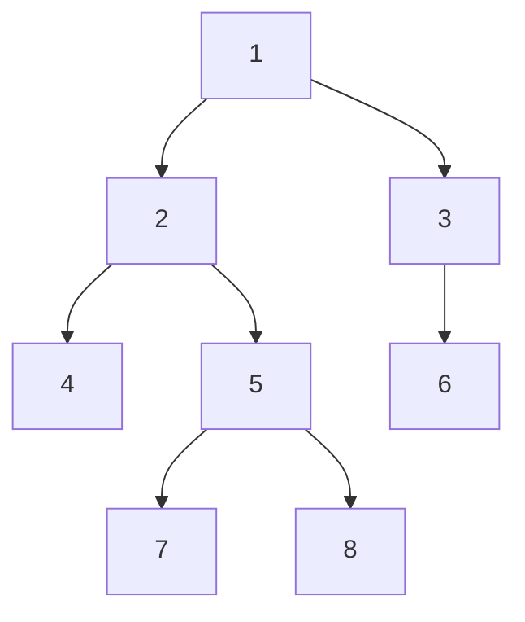

## 二叉树遍历方式

```mermaid
flowchart TD
    1 --> 2 & 3
    2 --> 4 & 5
    3 --> 6
    5 --> 7 & 8
```

前序遍历：根结点 ---> 左子树 ---> 右子树

1 2 4 5 7 8 3 6

中序遍历：左子树---> 根结点 ---> 右子树

4 2 7 5 8 1 3 6

后序遍历：左子树 ---> 右子树 ---> 根结点

4 7 8 5 2 3 6 1

层次遍历：只需按层次遍历即可

1 2 3 4 5 6 8 9

