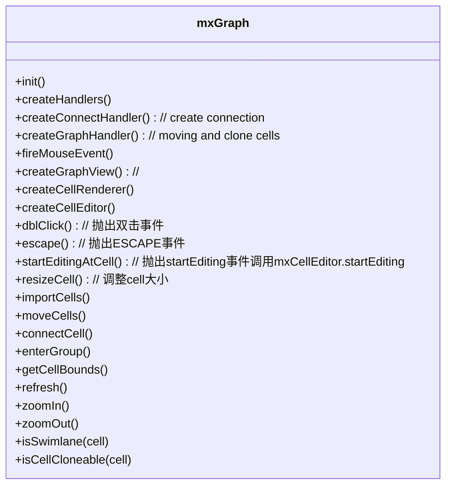
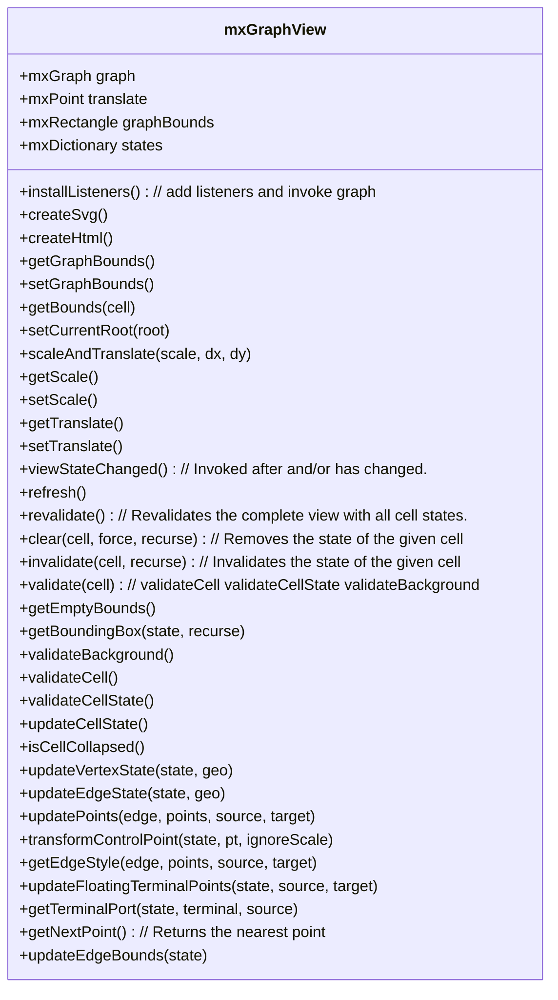

## packages

- editor
- handler
- model
- shape
- util // 工具包
- view
  - GraphView // 图视图
  - Graph
- io
- layout
- mxClient.js // 设置客户端信息，加载其他js







## Event handler

事件系统

``` javascript
mxGraph.prototype.fireMouseEvent = function(evtName, me, sender)
{
  // ...
  if (this.mouseListeners != null)
    {
      var args = [sender, me];

      // Does not change returnValue in Opera
      if (!me.getEvent().preventDefault)
      {
        me.getEvent().returnValue = true;
      }

      for (var i = 0; i < this.mouseListeners.length; i++)
      {
        var l = this.mouseListeners[i];

        if (evtName == mxEvent.MOUSE_DOWN)
        {
          l.mouseDown.apply(l, args);
        }
        else if (evtName == mxEvent.MOUSE_MOVE)
        {
          l.mouseMove.apply(l, args);
        }
        else if (evtName == mxEvent.MOUSE_UP)
        {
          l.mouseUp.apply(l, args);
        }
      }
    }
}

mxGraph.prototype.addMouseListener = function(listener)
{
	if (this.mouseListeners == null)
	{
		this.mouseListeners = [];
	}

	this.mouseListeners.push(listener);
};
```


``` javascript

mxGraphView.prototype.installListeners = function()
{
	var graph = this.graph;
	var container = graph.container;

	if (container != null)
	{
		// Fires event only for one pointer per gesture
		var pointerId = null;

		// Adds basic listeners for graph event dispatching
		mxEvent.addGestureListeners(container, mxUtils.bind(this, function(evt)
		{
			// Condition to avoid scrollbar events starting a rubberband selection
			if (this.isContainerEvent(evt) && ((!mxClient.IS_IE && !mxClient.IS_IE11 && !mxClient.IS_GC &&
				!mxClient.IS_OP && !mxClient.IS_SF) || !this.isScrollEvent(evt)))
			{
				graph.fireMouseEvent(mxEvent.MOUSE_DOWN, new mxMouseEvent(evt));
				pointerId = evt.pointerId;
			}
		}),
		mxUtils.bind(this, function(evt)
		{
			if (this.isContainerEvent(evt) && (pointerId == null || evt.pointerId == pointerId))
			{
				graph.fireMouseEvent(mxEvent.MOUSE_MOVE, new mxMouseEvent(evt));
			}
		}),
		mxUtils.bind(this, function(evt)
		{
			if (this.isContainerEvent(evt))
			{
				graph.fireMouseEvent(mxEvent.MOUSE_UP, new mxMouseEvent(evt));
			}

			pointerId = null;
		}));

		// Adds listener for double click handling on background, this does always
		// use native event handler, we assume that the DOM of the background
		// does not change during the double click
		mxEvent.addListener(container, 'dblclick', mxUtils.bind(this, function(evt)
		{
			if (this.isContainerEvent(evt))
			{
				graph.dblClick(evt);
			}
		}));
	}
};

mxGraphView.prototype.isContainerEvent = function(evt)
{
	var source = mxEvent.getSource(evt);

	return (source == this.graph.container ||
		source.parentNode == this.backgroundPane ||
		(source.parentNode != null &&
		source.parentNode.parentNode == this.backgroundPane) ||
		source == this.canvas.parentNode ||
		source == this.canvas ||
		source == this.backgroundPane ||
		source == this.drawPane ||
		source == this.overlayPane ||
		source == this.decoratorPane);
};

function getSource(evt)
{
  return (evt.srcElement != null) ? evt.srcElement : evt.target;
}

```


