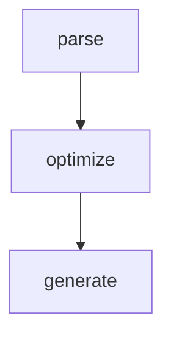

## Vue2和Vue3的编译区别
- 插件化 [Transform](./vue3-compiler-transform.md)

## Vue2的编译过程



Vue2源码在`src/compiler/index.ts`中

```typescript
import { parse } from './parser/index'
import { optimize } from './optimizer'
import { generate } from './codegen/index'
import { createCompilerCreator } from './create-compiler'
import { CompilerOptions, CompiledResult } from 'types/compiler'

export const createCompiler = createCompilerCreator(function baseCompile(
  template: string,
  options: CompilerOptions
): CompiledResult {
  // 转换ast
  const ast = parse(template.trim(), options)

  if (options.optimize !== false) {
    // 优化
    optimize(ast, options)
  }

  // 生成js代码
  const code = generate(ast, options)
  return {
    ast,
    render: code.render,
    staticRenderFns: code.staticRenderFns
  }
})

```


## Parse

``` html
<input v-model="value">
```

==>

``` javascript
{
  type: 1,
  tag: 'input',
  directives: [
    {
      'name': 'model',
      'value': 'value',
      'modifier': undefined
    }
  ],
  attrsMap: {
    'v-model': 'value'
  }
}
```

## Generate

```typescript
export function generate(
  ast: ASTElement | void,
  options: CompilerOptions
): CodegenResult {
  const state = new CodegenState(options)
  const code = ast
    ? ast.tag === 'script'
      ? 'null'
      : genElement(ast, state)
    : '_c("div")'
  return {
    render: `with(this){return ${code}}`,
    staticRenderFns: state.staticRenderFns
  }
}
```

## Generate

```typescript
export function generate(
  ast: ASTElement | void,
  options: CompilerOptions
): CodegenResult {
  // CodegenState中有directives属性
  const state = new CodegenState(options)
  const code = ast
    ? ast.tag === 'script'
      ? 'null'
      : genElement(ast, state)
    : '_c("div")'
  return {
    render: `with(this){return ${code}}`,
    staticRenderFns: state.staticRenderFns
  }
}
```

```typescript
function genDirectives (el: ASTElement, state: CodegenState): string | void {
  const dirs = el.directives
  if (!dirs) return
  let res = 'directives:['
  let hasRuntime = false
  let i, l, dir, needRuntime
  // 遍历el.directives
  for (i = 0, l = dirs.length; i < l; i++) {
    dir = dirs[i]
    needRuntime = true
    // 调用CodegenState实例的directives对应的指令处理函数进行处理
    const gen: DirectiveFunction = state.directives[dir.name]
    if (gen) {
      needRuntime = !!gen(el, dir, state.warn)
    }
    if (needRuntime) {
      hasRuntime = true
      res += `{name:"${dir.name}",rawName:"${dir.rawName}"${
        dir.value ? `,value:(${dir.value}),expression:${JSON.stringify(dir.value)}` : ''
      }${
        dir.arg ? `,arg:"${dir.arg}"` : ''
      }${
        dir.modifiers ? `,modifiers:${JSON.stringify(dir.modifiers)}` : ''
      }},`
    }
  }
  if (hasRuntime) {
    return res.slice(0, -1) + ']'
  }
}

```

```typescript
function genDefaultModel (
  el: ASTElement,
  value: string,
  modifiers: ?ASTModifiers
): ?boolean {
  const type = el.attrsMap.type
  const { lazy, number, trim } = modifiers || {}
  const needCompositionGuard = !lazy && type !== 'range'
  // 如果v-model.lazy则选择监听change事件，
  // input事件的触发机制是，当输入框内容发生变化时
  // change事件的触发机制是，当输入框失去焦点后且输入框内容发生变化时
  const event = lazy
    ? 'change'
    : type === 'range'
      ? RANGE_TOKEN
      : 'input'
  // valueExpression是用于event事件触发后，把valueExpression赋值到v-model绑定的值上,也就是value
  let valueExpression = '$event.target.value'
  // 如果v-model.trim，则事件触发把event.target.value赋值前调用trim()
  if (trim) {
    valueExpression = `$event.target.value.trim()`
  }
  // 如果v-model.number，则事件触发把event.target.value赋值前先调用parseFloat转换
  // target._n = toNumber;
  // function toNumber (val) {
  //   var n = parseFloat(val);
  //   return isNaN(n) ? val : n
  // }
  if (number) {
    valueExpression = `_n(${valueExpression})`
  }

  /**
  * genAssignmentCode (value: string,assignment: string): string {
      const res = parseModel(value)
      // 如果v-model="value"
      if (res.key === null) {
        return `${value}=${assignment}`
      // 如果v-model="value",即绑定的是一个对象中的属性
      } else {
        return `$set(${res.exp}, ${res.key}, ${assignment})`
      }
    }
  */
  let code = genAssignmentCode(value, valueExpression)
  if (needCompositionGuard) {
    code = `if($event.target.composing)return;${code}`
  }
  // 添加到prop中
  addProp(el, 'value', `(${value})`)
  // 添加到on事件中
  addHandler(el, event, code, null, true)
  // 以上两个处理过程相当于把节点处理为<input :value="value" @input="value=$event.target.value">
}
```

结果：
```typescript
function render() {
  with(this) {
    return _c('input', {
      directives: [{
        name: "model",
        rawName: "v-model",
        value: (value),
        expression: "value"
      }],
      domProps: {
        "value": (value)
      },
      on: {
        "input": function ($event) {
          if ($event.target.composing) return;
          value = $event.target.value
        }
      }
    })
  }
}
```
