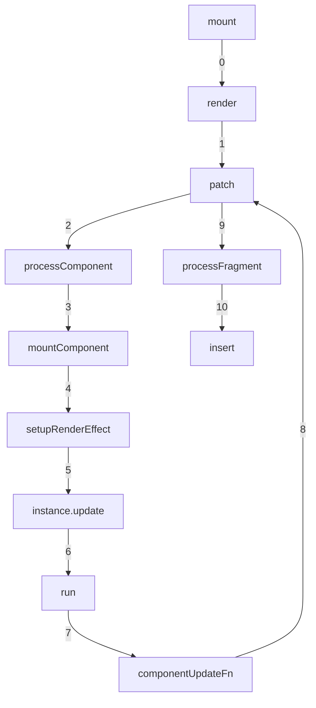

``` typescript
mount(rootContainer, isHydrate, isSVG) {
  if (!isMounted) {
    // 创建App.vue的vnode
    const vnode = createVNode(rootComponent, rootProps);
    vnode.appContext = context;
    // 渲染
    render(vnode, rootContainer, isSVG);
    isMounted = true;
    app._container = rootContainer;
    rootContainer.__vue_app__ = app;
    return getExposeProxy(vnode.component) || vnode.component.proxy;
  }
},
```

``` typescript
 const render = (vnode, container, isSVG) => {
  if (vnode == null) {
    if (container._vnode) {
        unmount(container._vnode, null, null, true);
    }
  }
  else {
    patch(container._vnode || null, vnode, container, null, null, null, isSVG);
  }
  flushPreFlushCbs();
  flushPostFlushCbs();
  container._vnode = vnode;
};
```

```typescript
const patch: PatchFn = (
  n1,
  n2,
  container,
  anchor = null,
  parentComponent = null,
  parentSuspense = null,
  isSVG = false,
  slotScopeIds = null,
  optimized = __DEV__ && isHmrUpdating ? false : !!n2.dynamicChildren
) => {
  if (n1 === n2) {
    return
  }

  // patching & not same type, unmount old tree
  if (n1 && !isSameVNodeType(n1, n2)) {
    anchor = getNextHostNode(n1)
    unmount(n1, parentComponent, parentSuspense, true)
    n1 = null
  }

  if (n2.patchFlag === PatchFlags.BAIL) {
    optimized = false
    n2.dynamicChildren = null
  }

  const { type, ref, shapeFlag } = n2
  switch (type) {
    case Text:
      processText(n1, n2, container, anchor)
      break
    case Comment:
      processCommentNode(n1, n2, container, anchor)
      break
    case Static:
      if (n1 == null) {
        mountStaticNode(n2, container, anchor, isSVG)
      } else if (__DEV__) {
        patchStaticNode(n1, n2, container, isSVG)
      }
      break
    case Fragment:
      processFragment(
        n1,
        n2,
        container,
        anchor,
        parentComponent,
        parentSuspense,
        isSVG,
        slotScopeIds,
        optimized
      )
      break
    default:
      if (shapeFlag & ShapeFlags.ELEMENT) {
        processElement(
          n1,
          n2,
          container,
          anchor,
          parentComponent,
          parentSuspense,
          isSVG,
          slotScopeIds,
          optimized
        )
      } else if (shapeFlag & ShapeFlags.COMPONENT) {
        processComponent(
          n1,
          n2,
          container,
          anchor,
          parentComponent,
          parentSuspense,
          isSVG,
          slotScopeIds,
          optimized
        )
      } else if (shapeFlag & ShapeFlags.TELEPORT) {
        ;(type as typeof TeleportImpl).process(
          n1 as TeleportVNode,
          n2 as TeleportVNode,
          container,
          anchor,
          parentComponent,
          parentSuspense,
          isSVG,
          slotScopeIds,
          optimized,
          internals
        )
      } else if (__FEATURE_SUSPENSE__ && shapeFlag & ShapeFlags.SUSPENSE) {
        ;(type as typeof SuspenseImpl).process(
          n1,
          n2,
          container,
          anchor,
          parentComponent,
          parentSuspense,
          isSVG,
          slotScopeIds,
          optimized,
          internals
        )
      } else if (__DEV__) {
        warn('Invalid VNode type:', type, `(${typeof type})`)
      }
  }

  // set ref
  if (ref != null && parentComponent) {
    setRef(ref, n1 && n1.ref, parentSuspense, n2 || n1, !n2)
  }
}
```

```typescript
const processComponent = (
  n1: VNode | null,
  n2: VNode,
  container: RendererElement,
  anchor: RendererNode | null,
  parentComponent: ComponentInternalInstance | null,
  parentSuspense: SuspenseBoundary | null,
  isSVG: boolean,
  slotScopeIds: string[] | null,
  optimized: boolean
) => {
  n2.slotScopeIds = slotScopeIds
  if (n1 == null) {
    if (n2.shapeFlag & ShapeFlags.COMPONENT_KEPT_ALIVE) {
      ;(parentComponent!.ctx as KeepAliveContext).activate(
        n2,
        container,
        anchor,
        isSVG,
        optimized
      )
    } else {
      mountComponent(
        n2,
        container,
        anchor,
        parentComponent,
        parentSuspense,
        isSVG,
        optimized
      )
    }
  } else {
    updateComponent(n1, n2, optimized)
  }
}
```

``` typescript
const mountComponent: MountComponentFn = (
  initialVNode,
  container,
  anchor,
  parentComponent,
  parentSuspense,
  isSVG,
  optimized
) => {
  // 2.x compat may pre-create the component instance before actually
  // mounting
  const compatMountInstance =
    __COMPAT__ && initialVNode.isCompatRoot && initialVNode.component
  const instance: ComponentInternalInstance =
    compatMountInstance ||
    (initialVNode.component = createComponentInstance(
      initialVNode,
      parentComponent,
      parentSuspense
    ))

  if (__DEV__ && instance.type.__hmrId) {
    registerHMR(instance)
  }

  if (__DEV__) {
    pushWarningContext(initialVNode)
    startMeasure(instance, `mount`)
  }

  // inject renderer internals for keepAlive
  if (isKeepAlive(initialVNode)) {
    ;(instance.ctx as KeepAliveContext).renderer = internals
  }

  // resolve props and slots for setup context
  if (!(__COMPAT__ && compatMountInstance)) {
    if (__DEV__) {
      startMeasure(instance, `init`)
    }
    setupComponent(instance)
    if (__DEV__) {
      endMeasure(instance, `init`)
    }
  }

  // setup() is async. This component relies on async logic to be resolved
  // before proceeding
  if (__FEATURE_SUSPENSE__ && instance.asyncDep) {
    parentSuspense && parentSuspense.registerDep(instance, setupRenderEffect)

    // Give it a placeholder if this is not hydration
    // TODO handle self-defined fallback
    if (!initialVNode.el) {
      const placeholder = (instance.subTree = createVNode(Comment))
      processCommentNode(null, placeholder, container!, anchor)
    }
    return
  }

  setupRenderEffect(
    instance,
    initialVNode,
    container,
    anchor,
    parentSuspense,
    isSVG,
    optimized
  )

  if (__DEV__) {
    popWarningContext()
    endMeasure(instance, `mount`)
  }
}
```

```typescript
 const setupRenderEffect: SetupRenderEffectFn = (
  instance,
  initialVNode,
  container,
  anchor,
  parentSuspense,
  isSVG,
  optimized
) => {
  const componentUpdateFn = () => {
    if (!instance.isMounted) {
      let vnodeHook: VNodeHook | null | undefined
      const { el, props } = initialVNode
      const { bm, m, parent } = instance
      const isAsyncWrapperVNode = isAsyncWrapper(initialVNode)

      toggleRecurse(instance, false)
      // beforeMount hook
      if (bm) {
        invokeArrayFns(bm)
      }
      // onVnodeBeforeMount
      if (
        !isAsyncWrapperVNode &&
        (vnodeHook = props && props.onVnodeBeforeMount)
      ) {
        invokeVNodeHook(vnodeHook, parent, initialVNode)
      }
      if (
        __COMPAT__ &&
        isCompatEnabled(DeprecationTypes.INSTANCE_EVENT_HOOKS, instance)
      ) {
        instance.emit('hook:beforeMount')
      }
      toggleRecurse(instance, true)

      if (el && hydrateNode) {
        // vnode has adopted host node - perform hydration instead of mount.
        const hydrateSubTree = () => {
          if (__DEV__) {
            startMeasure(instance, `render`)
          }
          instance.subTree = renderComponentRoot(instance)
          if (__DEV__) {
            endMeasure(instance, `render`)
          }
          if (__DEV__) {
            startMeasure(instance, `hydrate`)
          }
          hydrateNode!(
            el as Node,
            instance.subTree,
            instance,
            parentSuspense,
            null
          )
          if (__DEV__) {
            endMeasure(instance, `hydrate`)
          }
        }

        if (isAsyncWrapperVNode) {
          ;(initialVNode.type as ComponentOptions).__asyncLoader!().then(
            // note: we are moving the render call into an async callback,
            // which means it won't track dependencies - but it's ok because
            // a server-rendered async wrapper is already in resolved state
            // and it will never need to change.
            () => !instance.isUnmounted && hydrateSubTree()
          )
        } else {
          hydrateSubTree()
        }
      } else {
        if (__DEV__) {
          startMeasure(instance, `render`)
        }
        const subTree = (instance.subTree = renderComponentRoot(instance))
        if (__DEV__) {
          endMeasure(instance, `render`)
        }
        if (__DEV__) {
          startMeasure(instance, `patch`)
        }
        patch(
          null,
          subTree,
          container,
          anchor,
          instance,
          parentSuspense,
          isSVG
        )
        if (__DEV__) {
          endMeasure(instance, `patch`)
        }
        initialVNode.el = subTree.el
      }
      // mounted hook
      if (m) {
        queuePostRenderEffect(m, parentSuspense)
      }
      // onVnodeMounted
      if (
        !isAsyncWrapperVNode &&
        (vnodeHook = props && props.onVnodeMounted)
      ) {
        const scopedInitialVNode = initialVNode
        queuePostRenderEffect(
          () => invokeVNodeHook(vnodeHook!, parent, scopedInitialVNode),
          parentSuspense
        )
      }
      if (
        __COMPAT__ &&
        isCompatEnabled(DeprecationTypes.INSTANCE_EVENT_HOOKS, instance)
      ) {
        queuePostRenderEffect(
          () => instance.emit('hook:mounted'),
          parentSuspense
        )
      }

      // activated hook for keep-alive roots.
      // #1742 activated hook must be accessed after first render
      // since the hook may be injected by a child keep-alive
      if (
        initialVNode.shapeFlag & ShapeFlags.COMPONENT_SHOULD_KEEP_ALIVE ||
        (parent &&
          isAsyncWrapper(parent.vnode) &&
          parent.vnode.shapeFlag & ShapeFlags.COMPONENT_SHOULD_KEEP_ALIVE)
      ) {
        instance.a && queuePostRenderEffect(instance.a, parentSuspense)
        if (
          __COMPAT__ &&
          isCompatEnabled(DeprecationTypes.INSTANCE_EVENT_HOOKS, instance)
        ) {
          queuePostRenderEffect(
            () => instance.emit('hook:activated'),
            parentSuspense
          )
        }
      }
      instance.isMounted = true

      if (__DEV__ || __FEATURE_PROD_DEVTOOLS__) {
        devtoolsComponentAdded(instance)
      }

      // #2458: deference mount-only object parameters to prevent memleaks
      initialVNode = container = anchor = null as any
    } else {
      // updateComponent
      // This is triggered by mutation of component's own state (next: null)
      // OR parent calling processComponent (next: VNode)
      let { next, bu, u, parent, vnode } = instance
      let originNext = next
      let vnodeHook: VNodeHook | null | undefined
      if (__DEV__) {
        pushWarningContext(next || instance.vnode)
      }

      // Disallow component effect recursion during pre-lifecycle hooks.
      toggleRecurse(instance, false)
      if (next) {
        next.el = vnode.el
        updateComponentPreRender(instance, next, optimized)
      } else {
        next = vnode
      }

      // beforeUpdate hook
      if (bu) {
        invokeArrayFns(bu)
      }
      // onVnodeBeforeUpdate
      if ((vnodeHook = next.props && next.props.onVnodeBeforeUpdate)) {
        invokeVNodeHook(vnodeHook, parent, next, vnode)
      }
      if (
        __COMPAT__ &&
        isCompatEnabled(DeprecationTypes.INSTANCE_EVENT_HOOKS, instance)
      ) {
        instance.emit('hook:beforeUpdate')
      }
      toggleRecurse(instance, true)

      // render
      if (__DEV__) {
        startMeasure(instance, `render`)
      }
      const nextTree = renderComponentRoot(instance)
      if (__DEV__) {
        endMeasure(instance, `render`)
      }
      const prevTree = instance.subTree
      instance.subTree = nextTree

      if (__DEV__) {
        startMeasure(instance, `patch`)
      }
      patch(
        prevTree,
        nextTree,
        // parent may have changed if it's in a teleport
        hostParentNode(prevTree.el!)!,
        // anchor may have changed if it's in a fragment
        getNextHostNode(prevTree),
        instance,
        parentSuspense,
        isSVG
      )
      if (__DEV__) {
        endMeasure(instance, `patch`)
      }
      next.el = nextTree.el
      if (originNext === null) {
        // self-triggered update. In case of HOC, update parent component
        // vnode el. HOC is indicated by parent instance's subTree pointing
        // to child component's vnode
        updateHOCHostEl(instance, nextTree.el)
      }
      // updated hook
      if (u) {
        queuePostRenderEffect(u, parentSuspense)
      }
      // onVnodeUpdated
      if ((vnodeHook = next.props && next.props.onVnodeUpdated)) {
        queuePostRenderEffect(
          () => invokeVNodeHook(vnodeHook!, parent, next!, vnode),
          parentSuspense
        )
      }
      if (
        __COMPAT__ &&
        isCompatEnabled(DeprecationTypes.INSTANCE_EVENT_HOOKS, instance)
      ) {
        queuePostRenderEffect(
          () => instance.emit('hook:updated'),
          parentSuspense
        )
      }

      if (__DEV__ || __FEATURE_PROD_DEVTOOLS__) {
        devtoolsComponentUpdated(instance)
      }

      if (__DEV__) {
        popWarningContext()
      }
    }
  }

  // create reactive effect for rendering
  const effect = (instance.effect = new ReactiveEffect(
    componentUpdateFn,
    () => queueJob(update),
    instance.scope // track it in component's effect scope
  ))

  const update: SchedulerJob = (instance.update = () => effect.run())
  update.id = instance.uid
  // allowRecurse
  // #1801, #2043 component render effects should allow recursive updates
  toggleRecurse(instance, true)

  if (__DEV__) {
    effect.onTrack = instance.rtc
      ? e => invokeArrayFns(instance.rtc!, e)
      : void 0
    effect.onTrigger = instance.rtg
      ? e => invokeArrayFns(instance.rtg!, e)
      : void 0
    update.ownerInstance = instance
  }

  update()
}
```


```typescript
export class ReactiveEffect<T = any> {
  active = true
  deps: Dep[] = []
  parent: ReactiveEffect | undefined = undefined

  /**
   * Can be attached after creation
   * @internal
   */
  computed?: ComputedRefImpl<T>
  /**
   * @internal
   */
  allowRecurse?: boolean
  /**
   * @internal
   */
  private deferStop?: boolean

  onStop?: () => void
  // dev only
  onTrack?: (event: DebuggerEvent) => void
  // dev only
  onTrigger?: (event: DebuggerEvent) => void

  constructor(
    public fn: () => T,
    public scheduler: EffectScheduler | null = null,
    scope?: EffectScope
  ) {
    recordEffectScope(this, scope)
  }

  run() {
    if (!this.active) {
      return this.fn()
    }
    let parent: ReactiveEffect | undefined = activeEffect
    let lastShouldTrack = shouldTrack
    while (parent) {
      if (parent === this) {
        return
      }
      parent = parent.parent
    }
    try {
      this.parent = activeEffect
      activeEffect = this
      shouldTrack = true

      trackOpBit = 1 << ++effectTrackDepth

      if (effectTrackDepth <= maxMarkerBits) {
        initDepMarkers(this)
      } else {
        cleanupEffect(this)
      }
      return this.fn()
    } finally {
      if (effectTrackDepth <= maxMarkerBits) {
        finalizeDepMarkers(this)
      }

      trackOpBit = 1 << --effectTrackDepth

      activeEffect = this.parent
      shouldTrack = lastShouldTrack
      this.parent = undefined

      if (this.deferStop) {
        this.stop()
      }
    }
  }

  stop() {
    // stopped while running itself - defer the cleanup
    if (activeEffect === this) {
      this.deferStop = true
    } else if (this.active) {
      cleanupEffect(this)
      if (this.onStop) {
        this.onStop()
      }
      this.active = false
    }
  }
}
```


```typescript
 const processFragment = (
    n1: VNode | null,
    n2: VNode,
    container: RendererElement,
    anchor: RendererNode | null,
    parentComponent: ComponentInternalInstance | null,
    parentSuspense: SuspenseBoundary | null,
    isSVG: boolean,
    slotScopeIds: string[] | null,
    optimized: boolean
  ) => {
    const fragmentStartAnchor = (n2.el = n1 ? n1.el : hostCreateText(''))!
    const fragmentEndAnchor = (n2.anchor = n1 ? n1.anchor : hostCreateText(''))!

    let { patchFlag, dynamicChildren, slotScopeIds: fragmentSlotScopeIds } = n2

    if (
      __DEV__ &&
      // #5523 dev root fragment may inherit directives
      (isHmrUpdating || patchFlag & PatchFlags.DEV_ROOT_FRAGMENT)
    ) {
      // HMR updated / Dev root fragment (w/ comments), force full diff
      patchFlag = 0
      optimized = false
      dynamicChildren = null
    }

    // check if this is a slot fragment with :slotted scope ids
    if (fragmentSlotScopeIds) {
      slotScopeIds = slotScopeIds
        ? slotScopeIds.concat(fragmentSlotScopeIds)
        : fragmentSlotScopeIds
    }

    if (n1 == null) {
      hostInsert(fragmentStartAnchor, container, anchor)
      hostInsert(fragmentEndAnchor, container, anchor)
      // a fragment can only have array children
      // since they are either generated by the compiler, or implicitly created
      // from arrays.
      mountChildren(
        n2.children as VNodeArrayChildren,
        container,
        fragmentEndAnchor,
        parentComponent,
        parentSuspense,
        isSVG,
        slotScopeIds,
        optimized
      )
    } else {
      if (
        patchFlag > 0 &&
        patchFlag & PatchFlags.STABLE_FRAGMENT &&
        dynamicChildren &&
        // #2715 the previous fragment could've been a BAILed one as a result
        // of renderSlot() with no valid children
        n1.dynamicChildren
      ) {
        // a stable fragment (template root or <template v-for>) doesn't need to
        // patch children order, but it may contain dynamicChildren.
        patchBlockChildren(
          n1.dynamicChildren,
          dynamicChildren,
          container,
          parentComponent,
          parentSuspense,
          isSVG,
          slotScopeIds
        )
        if (__DEV__) {
          // necessary for HMR
          traverseStaticChildren(n1, n2)
        } else if (
          // #2080 if the stable fragment has a key, it's a <template v-for> that may
          //  get moved around. Make sure all root level vnodes inherit el.
          // #2134 or if it's a component root, it may also get moved around
          // as the component is being moved.
          n2.key != null ||
          (parentComponent && n2 === parentComponent.subTree)
        ) {
          traverseStaticChildren(n1, n2, true /* shallow */)
        }
      } else {
        // keyed / unkeyed, or manual fragments.
        // for keyed & unkeyed, since they are compiler generated from v-for,
        // each child is guaranteed to be a block so the fragment will never
        // have dynamicChildren.
        patchChildren(
          n1,
          n2,
          container,
          fragmentEndAnchor,
          parentComponent,
          parentSuspense,
          isSVG,
          slotScopeIds,
          optimized
        )
      }
    }
  }
```
