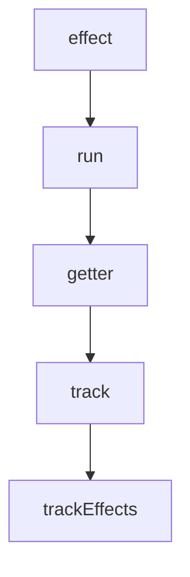
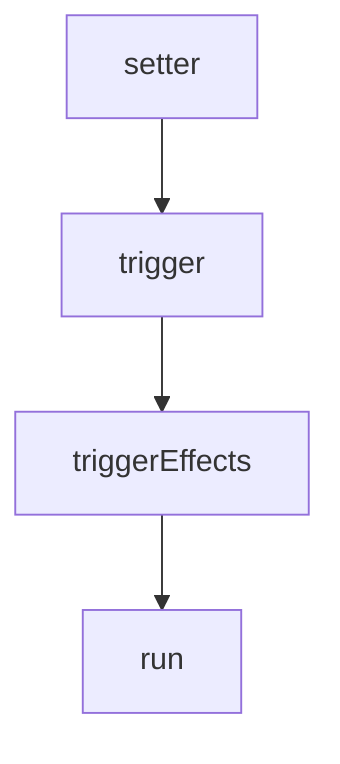

Effect is the core of the responsive system, and the responsive system is the core of vue3, so let's start with effect. First look at the parameter passing of the effect below, fn is the callback function, and options are the parameters passed in.

Here is the test in [effect test](https://github.com/vuejs/core/blob/main/packages/reactivity/__tests__/effect.spec.ts)

```typescript
it('should observe basic properties', () => {
  let dummy
  const counter = reactive({ num: 0 })
  effect(() => (dummy = counter.num))

  expect(dummy).toBe(0)
  counter.num = 7
  expect(dummy).toBe(7)
})
```


track:

trigger:


## effect

The `effect` function create `ReactiveEffect` instance and return the `runner`

Here is the [effect function](https://github.com/vuejs/core/blob/main/packages/reactivity/src/effect.ts#L180)

```typescript
export function effect<T = any>(
  fn: () => T,
  options?: ReactiveEffectOptions
): ReactiveEffectRunner {
  if ((fn as ReactiveEffectRunner).effect) {
    fn = (fn as ReactiveEffectRunner).effect.fn
  }

  // create ReactiveEffect instance
  const _effect = new ReactiveEffect(fn)
  if (options) {
    extend(_effect, options)
    if (options.scope) recordEffectScope(_effect, options.scope)
  }
  if (!options || !options.lazy) {
    _effect.run()
  }

  // get runner of effect
  const runner = _effect.run.bind(_effect) as ReactiveEffectRunner
  runner.effect = _effect
  return runner
}
```

## ReactiveEffect

`ReactiveEffect` holds the effect function. And the run function will call it.

Here is the [ReactiveEffect](https://github.com/vuejs/core/blob/main/packages/reactivity/src/effect.ts#L53)

```typescript
export class ReactiveEffect<T = any> {
  active = true
  deps: Dep[] = []
  parent: ReactiveEffect | undefined = undefined

  run() {
    if (!this.active) {
      return this.fn()
    }
    let parent: ReactiveEffect | undefined = activeEffect
    let lastShouldTrack = shouldTrack
    while (parent) {
      if (parent === this) {
        return
      }
      parent = parent.parent
    }
    try {
      this.parent = activeEffect
      // Here set the active effect
      activeEffect = this
      shouldTrack = true

      trackOpBit = 1 << ++effectTrackDepth

      if (effectTrackDepth <= maxMarkerBits) {
        initDepMarkers(this)
      } else {
        cleanupEffect(this)
      }
      // Here run the effect function
      return this.fn()
    } finally {
      if (effectTrackDepth <= maxMarkerBits) {
        finalizeDepMarkers(this)
      }

      trackOpBit = 1 << --effectTrackDepth

      activeEffect = this.parent
      shouldTrack = lastShouldTrack
      this.parent = undefined

      if (this.deferStop) {
        this.stop()
      }
    }
  }
}
```

## track

Create dep for target reactive object


```typescript
// target is { num: 0 }, type: 'get', key: 'num'
export function track(target: object, type: TrackOpTypes, key: unknown) {
  if (shouldTrack && activeEffect) {
    // targetMap is a WeakMap holding all deps
    let depsMap = targetMap.get(target)
    if (!depsMap) {
      targetMap.set(target, (depsMap = new Map()))
    }
    let dep = depsMap.get(key)
    if (!dep) {
      // createDep return a Dep which is a Set instance
      depsMap.set(key, (dep = createDep()))
    }

    const eventInfo = __DEV__
      ? { effect: activeEffect, target, type, key }
      : undefined

    trackEffects(dep, eventInfo)
  }
}

/**
 * targetMap:
 * {
 *   { num: 0 }: {
 *       num: Dep
 *   }
 * }
 */
```

## track effects

Add effect into the Dep's effect

```typescript
export function trackEffects(
  dep: Dep,
  debuggerEventExtraInfo?: DebuggerEventExtraInfo
) {
  let shouldTrack = false
  if (effectTrackDepth <= maxMarkerBits) {
    if (!newTracked(dep)) {
      dep.n |= trackOpBit
      shouldTrack = !wasTracked(dep)
    }
  } else {
    shouldTrack = !dep.has(activeEffect!)
  }

  if (shouldTrack) {
    // dep will add current active effect into its effects
    // active effect is setted by ActiveEffect.run
    dep.add(activeEffect!)
    // push dep into active effect's deps
    activeEffect!.deps.push(dep)
    if (__DEV__ && activeEffect!.onTrack) {
      activeEffect!.onTrack(
        extend(
          {
            effect: activeEffect!
          },
          debuggerEventExtraInfo!
        )
      )
    }
  }
}
```

## trigger

Finds all deps associated with the target (or a specific property) and triggers the effects stored within.


```typescript
/**
 * @param target - The reactive object.
 * @param type - Defines the type of the operation that needs to trigger effects.
 * @param key - Can be used to target a specific reactive property in the target object.
 */
export function trigger(
  target: object,
  type: TriggerOpTypes,
  key?: unknown,
  newValue?: unknown,
  oldValue?: unknown,
  oldTarget?: Map<unknown, unknown> | Set<unknown>
) {
  const depsMap = targetMap.get(target)
  if (!depsMap) {
    // never been tracked
    return
  }

  let deps: (Dep | undefined)[] = []
  if (type === TriggerOpTypes.CLEAR) {
    // collection being cleared
    // trigger all effects for target
    deps = [...depsMap.values()]
  } else if (key === 'length' && isArray(target)) {
    const newLength = Number(newValue)
    depsMap.forEach((dep, key) => {
      if (key === 'length' || key >= newLength) {
        deps.push(dep)
      }
    })
  } else {
    // schedule runs for SET | ADD | DELETE
    if (key !== void 0) {
      deps.push(depsMap.get(key))
    }

    // also run for iteration key on ADD | DELETE | Map.SET
    switch (type) {
      case TriggerOpTypes.ADD:
        if (!isArray(target)) {
          deps.push(depsMap.get(ITERATE_KEY))
          if (isMap(target)) {
            deps.push(depsMap.get(MAP_KEY_ITERATE_KEY))
          }
        } else if (isIntegerKey(key)) {
          // new index added to array -> length changes
          deps.push(depsMap.get('length'))
        }
        break
      case TriggerOpTypes.DELETE:
        if (!isArray(target)) {
          deps.push(depsMap.get(ITERATE_KEY))
          if (isMap(target)) {
            deps.push(depsMap.get(MAP_KEY_ITERATE_KEY))
          }
        }
        break
      case TriggerOpTypes.SET:
        if (isMap(target)) {
          deps.push(depsMap.get(ITERATE_KEY))
        }
        break
    }
  }

  const eventInfo = __DEV__
    ? { target, type, key, newValue, oldValue, oldTarget }
    : undefined

  if (deps.length === 1) {
    if (deps[0]) {
      if (__DEV__) {
        triggerEffects(deps[0], eventInfo)
      } else {
        triggerEffects(deps[0])
      }
    }
  } else {
    const effects: ReactiveEffect[] = []
    for (const dep of deps) {
      if (dep) {
        effects.push(...dep)
      }
    }
    if (__DEV__) {
      triggerEffects(createDep(effects), eventInfo)
    } else {
      triggerEffects(createDep(effects))
    }
  }
}
```

## triggerEffects

```typescript
export function triggerEffects(
  dep: Dep | ReactiveEffect[],
  debuggerEventExtraInfo?: DebuggerEventExtraInfo
) {
  const effects = isArray(dep) ? dep : [...dep]
  for (const effect of effects) {
    if (effect.computed) {
      triggerEffect(effect, debuggerEventExtraInfo)
    }
  }
  for (const effect of effects) {
    if (!effect.computed) {
      triggerEffect(effect, debuggerEventExtraInfo)
    }
  }
}

function triggerEffect(
  effect: ReactiveEffect,
  debuggerEventExtraInfo?: DebuggerEventExtraInfo
) {
  if (effect !== activeEffect || effect.allowRecurse) {
    if (__DEV__ && effect.onTrigger) {
      effect.onTrigger(extend({ effect }, debuggerEventExtraInfo))
    }
    if (effect.scheduler) {
      effect.scheduler()
    } else {
      effect.run()
    }
  }
}
```

## Reference

[effect](https://hkc452.github.io/slamdunk-the-vue3/main/vue/reactivity/effect.html)
