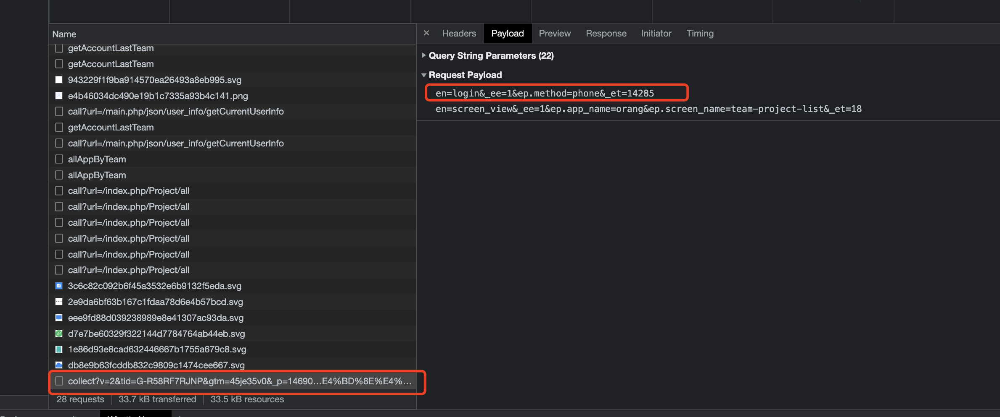

## Install
Vue2
```
yarn add vue-gtag@^1.16.1
```

Vue3
```
yarn add vue-gtag
```


## Use

``` javascript
import Vue from 'vue'
import VueGtag from 'vue-gtag';

Vue.use(VueGtag, {
  config: {
    id: 'XXXX',
  },
  appName: 'xxx',
  pageTrackerScreenviewEnabled: true
}, app.router)

```

``` javascript
export default {
  methods: {
    track() {
      this.$gtag.event('login', { method: 'phone' })
    }
  }
}
```

## Verify



## Reference

- [vue-gtag](https://matteo-gabriele.gitbook.io/vue-gtag/v/master/)


