# 资产协议

## 版本信息

最新版本: 0.1.0

创建时间: 2022-09-24

更新时间: 2022-09-24

## 变更日志

| 时间 | 版本号 | 变更人 |  主要变更内容
| --- | ---- | --- | --- |
| 2022-09-24 | 0.1.0  |  张逸 | 创建协议

## 背景

低代码平台中物料，可以被发布，引用和更新。

资产本身不会直接处理物料的内容，它的主要作用还是控制物料的版本及发布流程。

## 协议结构

|参数|说明|类型|必须|
|--|--|--|--|
|version| 版本|`string`|是|
|type| 类型|`string`|是|
|content| 资产内容|`string`|是|
|asset_uuid| 资源标识|`string`|是|
|changelog| 修改日志|`string`|是|
|migrate_script| 迁移脚本|`string`|否|
|state| 状态|`"test"\|"prod"`|是|
|create_user| 创建人|`string`|是|
|verify_user| 审核人|`string`|否|

### version

定义当前资产的版本，版本号的用处主要会用于资产的升级

版本号规范遵循[semver](https://semver.org/)

### type
类型区分不同资源标识

| 类型      | 描述 |
| ----------- | ----------- |
| component      | 组件       |
| component_config      | 组件配置       |
| method   | 方法块       |
| graph   | 图节点       |

### content
可以是资产实际内容也可以是内容的压缩地址

### asset_uuid

资产对应实体的唯一标识，全局唯一的32位字符串

### changelog

该版本的变更记录

### migrate_script

迁移脚本，资产有数据结构上面的变更时，需要执行该迁移脚本

### state
状态标记该资产的状态

| 状态      | 描述 |
| ----------- | ----------- |
| test      | 测试中       |
| prod   | 已上线       |

### create_user
资产的创建者

### verify_user
资产的审核者

## 资产流程

