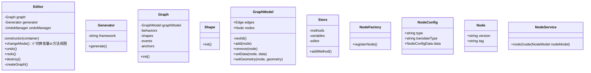

## 架构图

## 包

- editor     编辑器UI
- generator  代码生成器
- graph      绘图
- store      数据
- core       核心类型定义

##  类

```mermaid
classDiagram
    class Editor{
      constructor(container)
      -Graph graph
      -Generator generator
      -UndoManager undoManager
      +changeMode() // 切换变量or方法视图
      +undo()
      +redo()
      +destroy()
      -createGraph()
    }

    class Generator{
      -string framework
      +generate()
    }

    class Graph {
      -GraphModel graphModel
      -behaviors
      -shapes
      -events
      -anchors
      +init()
    }

    class Shape {
      +init()
    }

    class GraphModel {
      +Edge edges
      +Node nodes
      -nextId()
      +add(node)
      +remove(node)
      +setData(node, data)
      +setGeometry(node, geometry)
    }

    class Store {
        -methods
        -variables
        -editor
        +addMethod()
    }

    class NodeFactory {
      +registerNode()
    }

    class NodeConfig {
      +string type
      +string translateType
      +NodeConfigData data
    }

    class Node {
      +string version
      +string tag
    }

    class NodeService {
      +node2code(NodeModel nodeModel)
    }
```
