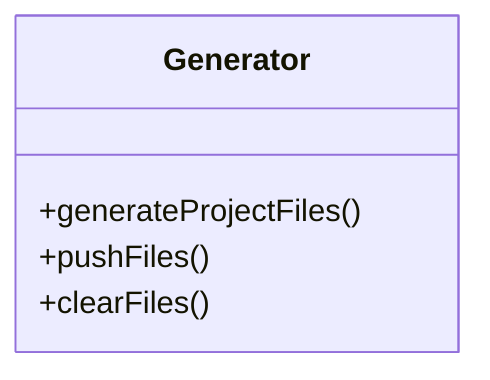

# 出码

根据单个或多个页面schema生成代码，根据生成的代码退仓，除了组件代码还要生成项目依赖。

支持相同端根据框架生成相关代码

- 支持全量生成
- 支持单文件生成（查看当前页面代码）

## 代码生成器

## 问题
1. 不能全量生成，不然页面数量多了会导致退仓卡顿, 退仓记录时间和文件更新时间对比，只做有修改的代码部分生成
2. 单次修改内容过多会导致diff的actions请求体过大，需要压缩或分片

## 监控

