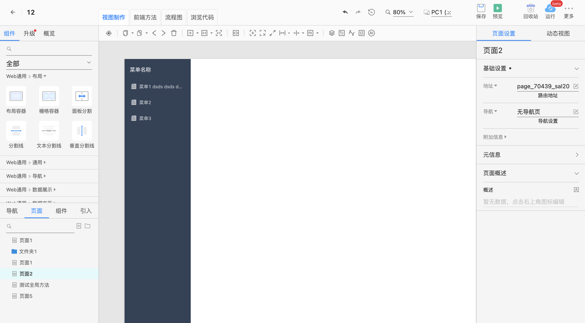

# 页面协议

## 版本信息

最新版本: 0.1.0

创建时间: 2022-09-24

更新时间: 2022-09-24

## 变更日志

| 时间 | 版本号 | 变更人 |  主要变更内容
| --- | ---- | --- | --- |
| 2022-09-24 | 0.1.0  |  张逸 | 创建协议

## 背景

页面是通过低代码平台组件搭建出来的产物

页面有以下区分 导航页面、普通页面和组件页面

页面可以设置自己的父页面

页面中可以使用其他组件页面

## 协议结构

### Page

组件资源栏能选到的所有组件

|参数|说明|类型|必须|
|--|--|--|--|
|uuid|唯一id|`string`|是|
|parent_uuid|当前页面对应的父页面uuid|`string`|是|
|version| 版本 |`string`|是|
|terminal_uuid| 终端uuid|`string`|是|
|label| 显示名|`string`|是|
|render_tree| 渲染树|`ComponentTree`|是|
|type| 页面类型|`string`|是|
|meta|	元数据|`string`|是|

### ComponentTree
组件树 参考[组件树](./component.md)

