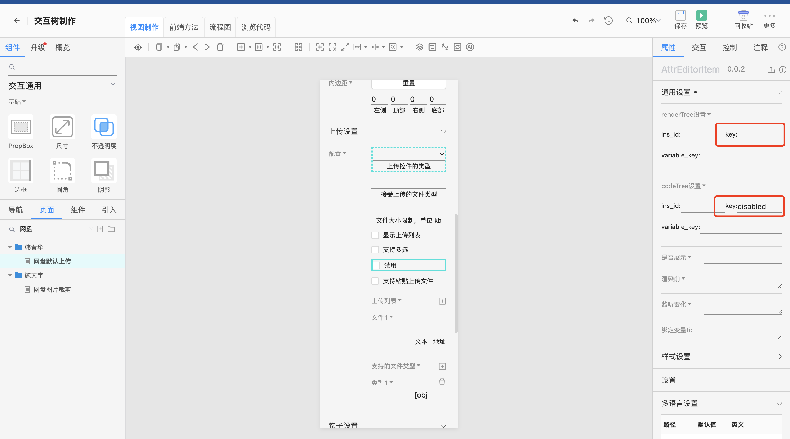

---
渲染
---

# 渲染

## 渲染隔离

未使用iframe，用transform属性创建包含块，可以将fixed元素包含在内

## 事件

1. 根元素做事件代理
2. 点击事件使用捕获（防止组件内部阻止冒泡）

## 问题
a 链接舞台上点击不跳转
上传按钮  组件舞台上点击 不弹选文件
微信小程序舞台渲染用的组件和实际出码组件不一样

实现方案code_tree和render_tree

``` json
// code tree
[
  {
    "id":0,
    "parentId":-1,
    "ins_id":"e0dde9dc59354dfea788d93b4740051f",
    "tag":"IdgNetdiskUpload",
    "data":{
      "type":"select",
      "disabled":false,
    },
    "mini_method_uuid": "sal20000_org_key2112063qv5zi6dpn"
  }
]
```
``` json
// render tree
[
  {
    "id":0,
    "parentId":-1,
    "ins_id":"e0dde9dc59354dfea788d93b4740051f",
    "tag":"IdgNetdiskUpload",
    "data":{
      "type":"select",
      "disabled":true, // 这边disabled初值设的true
    },
    "mini_method_uuid": "sal20000_org_key2112063qv5zi6dpn"
  }
]
```

交互层只修改code_tree不修改render_tree


这样就实现了舞台渲染和代码分离的能力


## 状态
hover
click
通过鼠标事件，改变类名

## 双击编辑

```
interface {

}
```

## 动态视图

对话框
