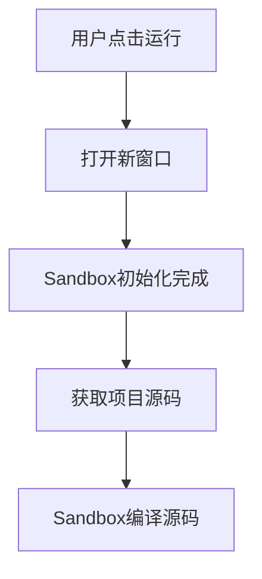

# 在线运行

## 背景
低代码生成的项目需要进行编译和运行，Web端除了本地调试工具以外，额外提供在线运行的能力。

## 流程


<!-- ## 时序 -->

<!-- ```mermaid
sequenceDiagram
    Editor->>Sandbox: open()
    Sandbox->>Editor: InitializedMessage
    Editor->>Sandbox: CompileMessage
``` -->


``` typescript
type DeserializedFetchedTar = {
  path: string;
  code: string | ArrayBuffer;
  isBinary: boolean;
};

interface NormalizedTar: {
  [path: string]: DeserializedFetchedTar;
};

interface CompileMessage {
  type: 'compile',
  entry: string, // 代码入口 '/index.js',
  modules: NormalizedTar, // 包含所有源代码内容
  template: string, // 表示 Compiler 的 Preset  如'vue-cli'
}

interface InitializedMessage{
  type: "initialized",
  codesandbox: true,
  url: string // "https://pkg.oneitfarm.com/gui-sandbox/0.1.4/"
}
```

## 问题
解决code sandbox一些不支持的webpack功能和扩展
比如修改sandpack兼容模块联邦


