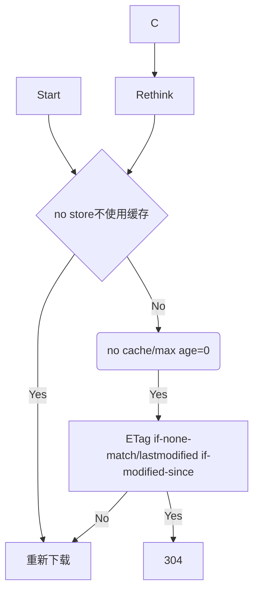

## 浏览器的缓存机制

1. 有强制缓存用强制缓存（expire_at\cache_control）
2. 协商缓存

```
no store: 不使用缓存
no cache: 不直接使用本地缓存，需要请求服务
public private: 代理服务器是否可以缓存

response：lastmodified -> 上次修改时间校验 -> request：if-modified-since
response：etag -> 文件内容 -> request: if-none-match

304
```

流程



代码

```
const http = require('http')
const fs = require('fs')
const url = require('url')
const etag = require('etag')

http.createServer((req, res) => {
  console.log(req.method, req.url)

  const { pathname } = url.parse(req.url)
  if (pathname === '/') {
    const data = fs.readFileSync('./index.html')
    res.end(data)
  } else if (pathname === '/img/01.jpg') {
    const data = fs.readFileSync('./img/01.jpg')
    res.writeHead(200, {
      // 缺点：客户端时间和服务器时间可能不同步
      Expires: new Date('2021-5-27 21:40').toUTCString()
    })
    res.end(data)
  } else if (pathname === '/img/02.jpg') {
    const data = fs.readFileSync('./img/02.jpg')
    res.writeHead(200, {
      'Cache-Control': 'max-age=5' // 滑动时间，单位是秒
    })
    res.end(data)
  } else if (pathname === '/img/03.jpg') {
    const { mtime } = fs.statSync('./img/03.jpg')

    const ifModifiedSince = req.headers['if-modified-since']

    if (ifModifiedSince === mtime.toUTCString()) {
      // 缓存生效
      res.statusCode = 304
      res.end()
      return
    }

    const data = fs.readFileSync('./img/03.jpg')

    // 告诉客户端该资源要使用协商缓存
    //   客户端使用缓存数据之前问一下服务器缓存有效吗
    //   服务端：
    //     有效：返回 304 ，客户端使用本地缓存资源
    //     无效：直接返回新的资源数据，客户端直接使用
    res.setHeader('Cache-Control', 'no-cache')
    // 服务端要下发一个字段告诉客户端这个资源的更新时间
    res.setHeader('last-modified', mtime.toUTCString())
    res.end(data)
  } else if (pathname === '/img/04.jpg') {
    const data = fs.readFileSync('./img/04.jpg')
    // 基于文件内容生成一个唯一的密码戳
    const etagContent = etag(data)

    const ifNoneMatch = req.headers['if-none-match']

    if (ifNoneMatch === etagContent) {
      res.statusCode = 304
      res.end()
      return
    }

    // 告诉客户端要进行协商缓存
    res.setHeader('Cache-Control', 'no-cache')
    // 把该资源的内容密码戳发给客户端
    res.setHeader('etag', etagContent)
    res.end(data)
  } else {
    res.statusCode = 404
    res.end()
  }
}).listen(3000, () => {
  console.log('http://localhost:3000')
})

```
