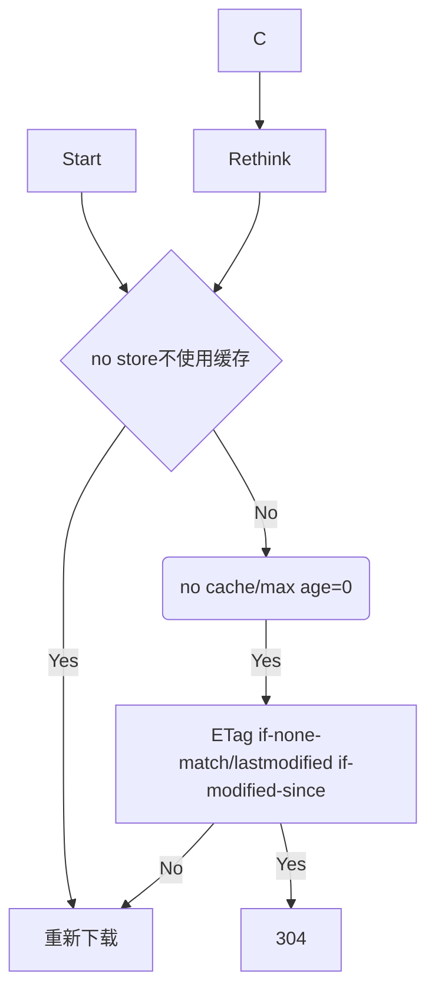

## 浏览器的缓存机制

1. 有强制缓存用强制缓存（expire_at\cache_control）
2. 协商缓存

```
no store: 不使用缓存
no cache: 不直接使用本地缓存，需要请求服务
public private: 代理服务器是否可以缓存

response：lastmodified -> 上次修改时间校验 -> request：if-modified-since
response：etag -> 文件内容 -> request: if-none-match

304
```

流程



代码

```
const http = require('http')
const fs = require('fs')
const url = require('url')
const etag = require('etag')

http.createServer((req, res) => {
  console.log(req.method, req.url)

  const { pathname } = url.parse(req.url)
  if (pathname === '/') {
    const data = fs.readFileSync('./index.html')
    res.end(data)
  } else if (pathname === '/img/01.jpg') {
    const data = fs.readFileSync('./img/01.jpg')
    res.writeHead(200, {
      // 缺点：客户端时间和服务器时间可能不同步
      Expires: new Date('2021-5-27 21:40').toUTCString()
    })
    res.end(data)
  } else if (pathname === '/img/02.jpg') {
    const data = fs.readFileSync('./img/02.jpg')
    res.writeHead(200, {
      'Cache-Control': 'max-age=5' // 滑动时间，单位是秒
    })
    res.end(data)
  } else if (pathname === '/img/03.jpg') {
    const { mtime } = fs.statSync('./img/03.jpg')

    const ifModifiedSince = req.headers['if-modified-since']

    if (ifModifiedSince === mtime.toUTCString()) {
      // 缓存生效
      res.statusCode = 304
      res.end()
      return
    }

    const data = fs.readFileSync('./img/03.jpg')

    // 告诉客户端该资源要使用协商缓存
    //   客户端使用缓存数据之前问一下服务器缓存有效吗
    //   服务端：
    //     有效：返回 304 ，客户端使用本地缓存资源
    //     无效：直接返回新的资源数据，客户端直接使用
    res.setHeader('Cache-Control', 'no-cache')
    // 服务端要下发一个字段告诉客户端这个资源的更新时间
    res.setHeader('last-modified', mtime.toUTCString())
    res.end(data)
  } else if (pathname === '/img/04.jpg') {
    const data = fs.readFileSync('./img/04.jpg')
    // 基于文件内容生成一个唯一的密码戳
    const etagContent = etag(data)

    const ifNoneMatch = req.headers['if-none-match']

    if (ifNoneMatch === etagContent) {
      res.statusCode = 304
      res.end()
      return
    }

    // 告诉客户端要进行协商缓存
    res.setHeader('Cache-Control', 'no-cache')
    // 把该资源的内容密码戳发给客户端
    res.setHeader('etag', etagContent)
    res.end(data)
  } else {
    res.statusCode = 404
    res.end()
  }
}).listen(3000, () => {
  console.log('http://localhost:3000')
})

```

## 从浏览器输入地址到呈现出网页的过程

- async script会在script下载完成时立即执行，和构造render树并行
- defer script会在文档渲染完毕后，DOMContentLoaded事件调用前执行
- html、css、font这三种类型的资源优先级最高
- TLS握手
- 客户端请求服务端的证书
- 第一次非对称加密，用CA的公钥去解证书的签名，如果解出来的hash和证书信息hash一致则合法
- 第二次非对称加密，客户端使用服务端公钥加密随机数
- 服务端使用服务端私钥解密随机数
- 使用随机数进行对称加密
- 查看是否有有效的service worker缓存
- 判断是否有强缓存，也就是未过期的资源，靠expire和cache-control判断
- DNS域名解析
- 进行三次握手+TLS握手
- 向资源发送请求
- 协商缓存，使用if-modified-since和etag与服务器对比，或没有改变取本地缓存，返回的状态码是304
- 取回资源
- 解析网页资源，下载网页中的资源
- 生成dom树和css树，构造render树
- 重排、重绘、合成
- 当DOM的变化引发了元素几何属性的变化，比如改变元素的宽高，元素的位置，导致浏览器不得不重新计算元素的几何属性，并重新构建渲染树，这个过程称为“重排”。完成重排后，要将重新构建的渲染树渲染到屏幕上，这个过程就是“重绘”。
- 首次渲染时一定会执行重排，后续如果不改变元素的外形位置尺寸则可以只执行重绘，不执行重排。
- 重绘得到的像素使用GPU绘制在页面上，一些特殊的element会单独为一个合成层（比如will-change、或者3D转换等），合理使用合成层可以提高动画效果
- 触发DOMContentLoaded事件
- 加载图片等外部文件
- 触发load事件
- 下载preload资源（通过标签预加载）

## async和defer
async加载完立即执行，defer则在domcontentloaded之前执行
