## 事件代理

事件委托是一种涉及将事件侦听器添加到父元素而不是将它们添加到后代元素的技术。 好处：

- 内存占用减少了，因为父元素只需要一个处理程序，而不必在每个后代元素上附加事件处理程序。
- 无需从已删除的元素中取消绑定处理程序，也无需为新元素绑定事件。

## 解释下this

总结this指向函数的调用者，箭头函数体内的this对象，就是定义该函数时所在的作用域指向的对象，而不是使用时所在的作用域指向的对象。

1. 普通function this指向Window
``` javascript
(function test(){ console.log(this)})()

// Window {0: global, window: Window, self: Window, document: document, name: '', location: Location, …}
```
2. 如果用apply/call可以改变this的指向
``` javascript
(function test(){ console.log(this)}).call({ a: 1})

// {a: 1}
```
3. 类中的函数this指向class实例
```javascript
function Test() { }
Test.prototype.test = function() { console.log(this)}
(new Test()).test()

// Test {}
```
4. 如果函数是 ES2015 箭头函数，它会忽略上面的所有规则，并在创建时接收其周围作用域的 this 值。
```javascript
(()=>{console.log(this)}).call({})
// Window {}
```

## ES6新特性
let const 块级作用域的变量
箭头函数

## 箭头函数

- 不可以当作构造函数，也就是说，不可以使用new命令，否则会抛出一个错误。
- 不可以使用arguments对象，该对象在函数体内不存在。如果要用，可以用 rest 参数代替。
- 不可以使用yield命令，因此箭头函数不能用作 Generator 函数。

## 解释原型继承是如何工作的

``` javascript
function Parent() {
  this.name = 'Parent'
}
Parent.prototype.test = function(){}

function Child() {
  Parent.call(this) // super
}
Child.prototype = Object.create(Parent.prototype)
Child.prototype.constructor = Child

console.log(new Child().name)
console.log(new Child().test)
```

属性的查找先找自己的对象属性，再找__proto__上面的属性一直到null为止
Child的prototype.__proto__指向了Parent.prototype这样child就能找到Parent定义的方法

结构如下：


## 你如何看待 AMD 与 CommonJS
AMD是web端requirejs按需加载模块
CommonJS服务端node的规范

``` javascript
define('a', ['b'], function(b) {
  return
})

require('b')
module.exports = {}
```

## 什么是闭包，以及如何/为什么使用闭包

闭包是由 函数 以及声明该函数的 词法环境 组合而成的

```javascript
function test() {
  var a = 1
  return function() {
    debugger
    console.log(a)
  }
}

const a = test()
a()
```
执行到debugger的时候，Scope中如下：
``` javascript
Scope {
  Local: { this: Window},
  Closure(test): { a: 1 }
}
```

=> 模拟C++ javascript线程
``` javascript
class ContextStack {
  push
}
stack = new ContextStack

class Context {
  Scope: {} // 变量环境 VO
  Closure: {} // 词法环境

  eval(code) {
    compile(code)
    exec()
  }

  compile() {
    // { FunctionDeclaration: { test }, VariableDeclaration: { }, CallExpression: { test }}
    parse()
    // find declarations put into VO
    // VO { a: undefined, test: undefined}
    declarationsVo()
    // 转化为字节码
    execByteCode()
  }

  exec(bytecodes) {
    bytecodes.forEach(bytecode => {
      if (bytecode === CallExpression) {
        const ctx = new Context()
        this.stack.push(ctx)
        ctx.eval(expression.code)
        this.stack.pop()
      }
    });
  }
}
new Context().eval('...')
```

用处：
1. 私有变量

## 防抖、节流
节流（throttle）
``` javascript
function throttle() {
  let doing = false
  if (doing) {
    return
  }
  doing = true

  setTimeout(() => {
    console.log('sdf')
    doing = false
  }, 500);
}
```

防抖（debounce）
``` javascript
function debounce() {
  let timer
  if (timer) {
    clearTimeout(timer)
    return
  }

  timer = setTimeout(() => {
    timer = null
    console.log('sdf')
  }, 500)
}
```
