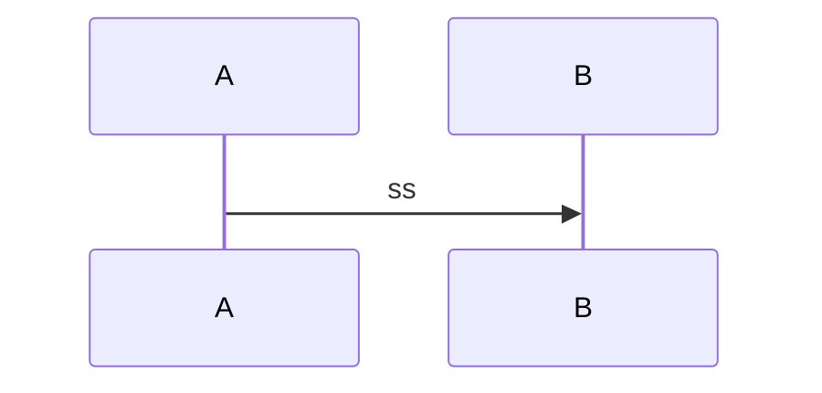
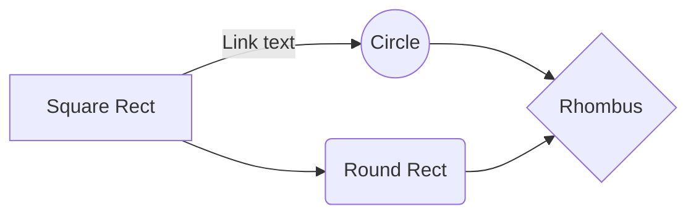

## index

The **Pythagorean equation**: $a=\sqrt{b^2 + c^2}$.

``` mermaid
sequenceDiagram
  A ->> B: ss
```

```mermaid
graph LR
A[Square Rect] -- Link text --> B((Circle))
A --> C(Round Rect)
B --> D{Rhombus}
C --> D
```
