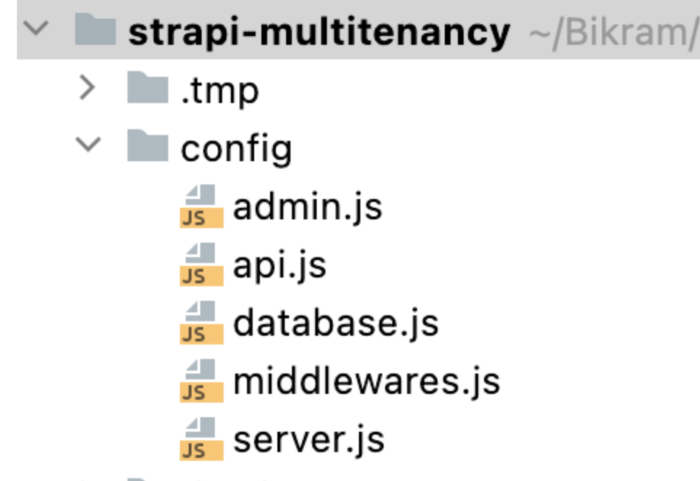
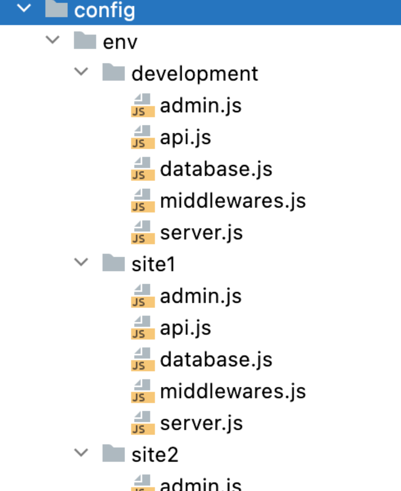

# 如何在 Strapi 中构建伪多租户应用程序？

## 介绍

在 Strapi 中，多租户方法是指系统为多个租户或客户提供服务的能力，每个租户或客户都有自己隔离和独立的资源集，例如内容、用户和权限。它允许您使用单个代码库创建多个应用程序实例。通过这种方式，所有客户端都有一个单独的数据库、主题和每个 Strapi 实例的单独域。运行多租户的优势在于您可以轻松地向所有客户端轻松推出新功能，并且通过可扩展的解决方案维护成本低。

本教程将展示如何运行共享相同代码的多个 Strapi 应用程序。这不是多租户的完整方法。但它解决了一些问题，比如同时将相同的功能滚动到多个网站。我跑过十来个应用，比如驾校、珠宝店、个人作品集和教育咨询。

方法很简单。我为每个实例或网站都有一个单独的数据库，但它们都从一个代码库运行。所以它以某种方式充当多租户。我已经能够为每个客户管理不同的主题，但可以同时为所有实例推出相同的功能。


## 前提
- nginx
- Let’s Encrypt for SSL
- MySQL Database
- phpMyAdmin (DB management )
- Netlify ( For Frontend )
- Node.js v16+
- Ubuntu 20.04

## 创建一个Strapi应用

``` bash
 npx create-strapi-app@latest strapi-multitenancy
 cd strapi-multitenancy
 yarn
 yarn run develop
```


## 添加Mysql

``` bash
npm install mysql --save
```

## 修改配置
默认的项目配置



多site项目配置




## 创建Mysql数据库

创建三个数据库
- development
- site1
- site2

## 更新数据库配置

默认的数据库配置

``` javascript
const path = require('path');

module.exports = ({ env }) => ({
  connection: {
    client: 'sqlite',
    connection: {
      filename: path.join(__dirname, '..', env('DATABASE_FILENAME', '.tmp/data.db')),
    },
    useNullAsDefault: true,
  },
});
```

我们想将其更改为 MySQL 和每个特定的网站。在我的环境中，数据库用户名是root，数据库密码是root。 现在您将更新 site1 和 site2，如下所示。 site1 的数据库配置：

site1:

``` javascript
module.exports = ({ env }) => ({
  connection: {
    client: 'mysql',
    connection: {
      host: env('DATABASE_HOST', 'localhost'),
      port: env.int('DATABASE_PORT', 3306),
      database: env('DATABASE_NAME', 'site1'),
      user: env('DATABASE_USERNAME', 'root'),
      password: env('DATABASE_PASSWORD', 'root'),
      ssl: env.bool('DATABASE_SSL', false),
    },
  },
});
```

site2:

``` javascript
module.exports = ({ env }) => ({
  connection: {
    client: 'mysql',
    connection: {
      host: env('DATABASE_HOST', 'localhost'),
      port: env.int('DATABASE_PORT', 3306),
      database: env('DATABASE_NAME', 'site2'),
      user: env('DATABASE_USERNAME', 'root'),
      password: env('DATABASE_PASSWORD', 'root'),
      ssl: env.bool('DATABASE_SSL', false),
    },
  },
});
```

## 修改Host配置

现在我们需要为运行三个应用程序指定不同的主机端口。默认的 server.js 文件如下，我们需要更新它。

默认的Host配置

``` javascript
module.exports = ({ env }) => ({
  host: env('HOST', '0.0.0.0'),
  port: env.int('PORT', 1337),
  app: {
    keys: env.array('APP_KEYS'),
  },
});
```

让我们为应用程序主机进行修改。这是 app site1 的配置：

``` javascript
module.exports = ({ env }) => ({
  host: env('HOST', '0.0.0.0'),
  port: env.int('HOST_PORT_SITE1', 4338),
  app: {
    keys: env.array('APP_KEYS'),
  },
});
```

让我们为应用程序主机进行修改。这是 app site2 的配置：
``` javascript
module.exports = ({ env }) => ({
  host: env('HOST', '0.0.0.0'),
  port: env.int('HOST_PORT_SITE1', 4339),
  app: {
    keys: env.array('APP_KEYS'),
  },
});
```

## PM2

安装PM2

``` bash
npm install pm2@latest -g
```

pm2 配置文件必须位于根级别，文件名为 ecosystem.config.js。 pm2配置如下。

``` javascript
module.exports = {
  apps: [
    {
      name: 'site1',
      cwd: '/Users/bikramkawan/Bikram/strapi-multitenancy-v4',
      script: 'npm',
      args: 'start',
      env: {
        NODE_ENV: 'site1',
        HOST_PORT_SITE1: 4338,
        DOMAIN_URL: 'site1.example.com'
      }
    },
    {
      name: 'site2',
      cwd: '/Users/bikramkawan/Bikram/strapi-multitenancy-v4',
      script: 'npm',
      args: 'start',
      env: {
        NODE_ENV: 'site2',
        HOST_PORT_SITE2: 4339,
        DOMAIN_URL: 'site2.example.com'
      }
    }
  ]
};
```

从上面的配置中，您需要更改应用程序所在的正确路径：

- cwd -> 切换到创建 Strapi 应用程序的目录
- 数据库凭据
- 主机端口
- DOMAIN_URL 用于完全限定的域，例如 strapimultitest1.example.com

## 本地环境测试

此时，该应用程序应该在您在本地计算机上执行的本地环境中运行。它应该可以通过本地主机或任​​一公共 IP 访问。

运行在根目录下运行此命令的应用程序：

``` bash
pm2 start ecosystem.config.js
```

理想情况下，您应该能够访问 http://localhost:4338/ 和 http://localhost:4339/

## 配置生产环境的nginx

根据您的发行版，您需要正确安装 nginx。我正在运行 ubuntu 20.04。请随时按照任何文档在您的发行版上安装 nginx。我按照 [DigitalOcean](https://www.digitalocean.com/community/tutorials/how-to-install-nginx-on-ubuntu-20-04) 文章安装了 nginx。

确保端口 80 和端口 443（用于 SSL）处于打开状态很重要。安装成功后，我们将配置正确的文件。

转到 cd /etc/nginx/sites-available，然后使用 vi strapimultitest1.example.com 创建 site1.example.com 的文件。只需 vi /etc/nginx/sites-available/site1.example.com 并粘贴以下内容。根据你的应用服务器更改对应的端口 127.0.0.1:4338；

``` nginx
upstream site1.example.com {
  server 127.0.0.1:4338;
  keepalive 64;
}

server {
  server_name site1.example.com;
  access_log /var/log/nginx/site1.example.com-access.log;
  error_log /var/log/nginx/site1.example.com-error.log;
  location / {
    proxy_set_header X-Real-IP $remote_addr;
    proxy_set_header X-Forwarded-For $proxy_add_x_forwarded_for;
    proxy_set_header X-Forwarded-Proto $scheme;
    proxy_set_header Host $http_host;
    proxy_set_header X-NginX-Proxy true;
    proxy_set_header Upgrade $http_upgrade;
    proxy_set_header Connection "upgrade";
    proxy_pass http://site1.example.com;
    proxy_redirect off;
    proxy_http_version 1.1;
    proxy_cache_bypass $http_upgrade;
  }
}

server {
  listen 80;
  server_name site1.example.com;
}


server {
  server_name site1.example.com;
    listen 80;
    return 404;
}
```

我们需要为 site2 创建另一个文件：

``` nginx
upstream site2.example.com {
  server 127.0.0.1:4339;
  keepalive 64;
}

server {
  server_name site2.example.com;
  access_log /var/log/nginx/site2.example.com-access.log;
  error_log /var/log/nginx/site2.example.com-error.log;
  location / {
    proxy_set_header X-Real-IP $remote_addr;
    proxy_set_header X-Forwarded-For $proxy_add_x_forwarded_for;
    proxy_set_header X-Forwarded-Proto $scheme;
    proxy_set_header Host $http_host;
    proxy_set_header X-NginX-Proxy true;
    proxy_set_header Upgrade $http_upgrade;
    proxy_set_header Connection "upgrade";
    proxy_pass http://site2.example.com;
    proxy_redirect off;
    proxy_http_version 1.1;
    proxy_cache_bypass $http_upgrade;
  }
}

server {
  listen 80;
  server_name site2.example.com;
}

server {
  server_name site2.example.com;
    listen 80;
    return 404;

}
```

然后创建 nginx 配置文件后，运行：

``` bash
sudo ln -s /etc/nginx/sites-available/site1.example.com /etc/nginx/sites-enabled/site1.example.com

sudo ln -s /etc/nginx/sites-available/site2.example.com /etc/nginx/sites-enabled/site2.example.com
```

通过运行检查 nginx 配置是否正常：
``` bash
sudo nginx -t
```

重启nginx
``` bash
sudo systemctl restart nginx
```

如果端口 80 打开，则应用程序 site1.example.com 和 site2.example.com 都应该可以访问。

## 安装SSL证书

让我们保护我们的应用程序并安装 SSL 证书。查看 Strapi [文档](https://docs.strapi.io/dev-docs/deployment/amazon-aws)以安装 SSL 证书。

运行以下命令：

``` bash
sudo apt install certbot python3-certbot-nginx -y
```

现在我们需要添加我们的域：
``` bash
certbot --nginx -d site1.example.com -d site2.example.com
```

它现在应该在两个域上运行 SSL。


## 总结

在本教程中，我们将学习如何在 Strapi 上创建多租户。这意味着您可以使用单独的域和单独的数据库运行多个 Strapi 实例。但是具有相同的代码库。通过这种方法，我们将节省维护应用程序的时间，并轻松推出新功能。

这是我为您可以在本地主机或生产环境中自行测试的方法创建的 [GitHub 存储库](https://github.com/bikramkawan/strapi-multitenancy-v4)。

您可以加入 [Discord 社区](https://discord.com/invite/strapi)，与更多使用 Strapi 的人联系。您可以寻求帮助或从社区获得问题的答案。

如果您在评论中遇到问题，请告诉我。谢谢你！

## 引用

[how-to-build-a-pseudo-multi-tenant-application-in-strapi](https://strapi.io/blog/how-to-build-a-pseudo-multi-tenant-application-in-strapi)
