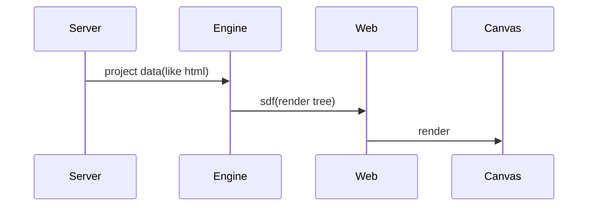
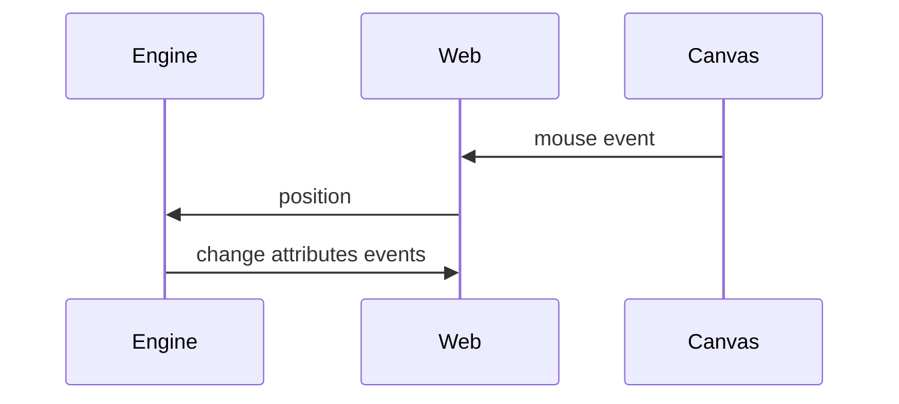
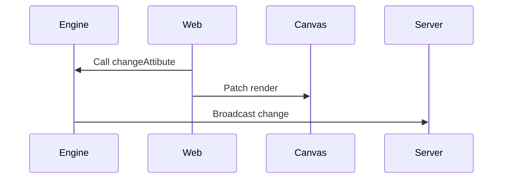
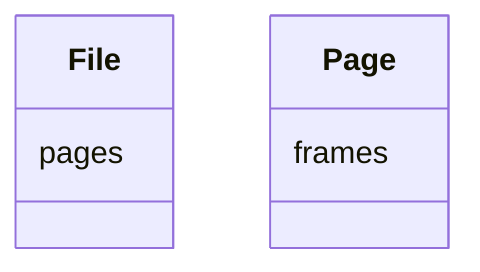

## 初始化

```mermaid
sequenceDiagram
  participant Server
  participant Engine
  participant Web
  participant Canvas

  Server ->> Engine : project data(like html);
  Engine ->> Web : sdf(render tree);
  Web ->> Canvas: render
```

## 用户拖动

```mermaid
sequenceDiagram
  participant Engine
  participant Web
  participant Canvas

  Canvas ->> Web: mouse event
  Web ->> Engine: position
  Engine ->> Web: change attributes events
```

## 属性设置

```mermaid
sequenceDiagram
  participant Engine
  participant Web
  participant Canvas

  Web ->> Engine: Call changeAttibute
  Web ->> Canvas: Patch render
  Engine ->> Server: Broadcast change
```

## 结构设计

```mermaid
classDiagram

class File {
  pages
}
class Page {
  frames
}
```
